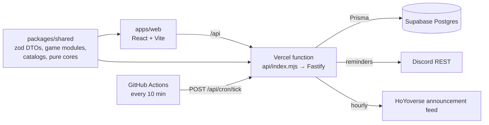

# ◈ Gacha Hub

One place to run several gacha games at once: pulls you can afford, dailies left before reset, who you own and how far their builds are, what to farm today, and which banners and events are running — with Discord sign-in and Discord DM reminders.

[](https://github.com/adam-riffi/gacha-hub/actions/workflows/ci.yml)
[](LICENSE)

**Live:** https://gacha-hub-two.vercel.app (Discord sign-in, whitelisted friends). Ships with Genshin Impact, Honkai: Star Rail, Wuthering Waves, Zenless Zone Zero and Arknights: Endfield.

## Why it is interesting

- **The hard problem:** every game resets, rotates its farming domains and announces banners on its own clock, and the official announcement feed serves the same notice in Asia, Europe or America time while labelling all of them UTC+1.
- **The approach:** each game is a hardcoded module with a bespoke sheet; game data comes only from importers over open datasets; pure, property-tested cores do the clock math (game day, reset, domains today) and recover the European time from any two feed observations.
- **A measured result:** the whole app runs on free tiers (one Vercel function, Supabase, a GitHub Actions cron) with 149 KB of initial JavaScript gzipped (budget 200 KB, checked in CI); catalogs load per game on demand.

## How it works



- **Contracts:** inputs are validated and outputs parsed through the same zod DTOs in `packages/shared`, so the web types cannot drift from the API.
- **Game day:** rotating domains flip at the region's daily reset, not at midnight (`packages/shared/src/domains.ts`); the game page and reminders list the domains open today for the units you own.
- **Planning:** level and talent targets become material requirements and one farming goal per material; inventory is the source of truth for progress.
- **Official feed:** Genshin wishes and HSR warps (one banner per warp section) import hourly with their featured units matched against the catalog (`apps/server/src/lib/officialFeed.ts`).
- **Reminders:** idempotent per rule and reset boundary, so the cron may tick at any cadence.

The full specification is [docs/DESIGN.md](docs/DESIGN.md).

## Evaluation

| Measure | Value |
| --- | --- |
| Initial JavaScript (gzipped) | 149 KB (React 19, React Router 7, zod 4); budget 200 KB; each game catalog loads lazily (1–73 KB gzipped) |
| Tests | 157 unit, property and route-integration tests; 7 Playwright journeys |
| Feed import (2026-10-05) | Genshin: 3 banners and 13 events; HSR: 4 warps and 4 events |

## Testing approach

- **Unit and property tests** (Vitest, fast-check) for the pure cores: resets and game day (500 seeded cases against a luxon reference), planning math, feed parsing and the time-variant rule, document migrations.
- **Route integration tests** build the real Fastify app over a throwaway SQLite database (`*.integration.test.ts`), including a reminder tick with Discord mocked.
- **End-to-end:** Playwright journeys against the built app on a fresh SQLite database, signed in with the dev login (Home, game overview, calendar, pull log, data export).
- **Production smoke:** after every production deploy, `scripts/smoke.mjs` checks the shell, the API's auth guard and that the dev login is off.
- CI runs `lint`, `typecheck`, `test`, `build` and `e2e` on every pull request.

## Running locally

Prerequisites: the Node version in [.nvmrc](.nvmrc). No database server needed (SQLite).

```bash
npm ci
cp .env.example .env        # defaults: SQLite, dev login on
npm run db:sqlite           # create the local SQLite database
npm run dev                 # web :5173, API :3000
```

Open http://localhost:5173 and click **Continue as Dev User**. To act as admin locally, set `ADMIN_DISCORD_IDS=dev-local-user`.

Before a pull request, run "Check all": `npm run check` (lint, typecheck, tests, build, E2E; run `npx playwright install chromium` once). Every command is listed in [AGENTS.md](AGENTS.md); the workflow rules are in [docs/ENGINEERING.md](docs/ENGINEERING.md).

**Catalogs** are committed JSON produced by `scripts/catalog/` (sources and licences in [NOTICE](NOTICE)): `npm run catalog:install` once, then `npm run catalog:<game>`; delete `scripts/catalog/.cache/<game>` first for fresh data.

**Deploying** to Vercel + Supabase is described in [docs/DEPLOY.md](docs/DEPLOY.md). Never set `NODE_ENV` on Vercel (the install would drop dev dependencies); production safety comes from `DEV_LOGIN_ENABLED=false` and `COOKIE_SECURE=true`.

## Project structure

```
packages/shared/src/games/<key>   One module per game: currencies, regions, tasks, limits,
                                  bespoke build schema, migrations, catalog.json
packages/shared/src/              dto/ · catalog/ · planning/ · domains.ts · art.ts
apps/server/src/                  api/ (one file per resource) · lib/ (pure core) ·
                                  scheduler/ (reminders) · discord/ · games/ (bot hooks)
apps/web/src/                     pages/ · components/ · games/<key>/ (bespoke sheets) · lib/
e2e/                              Playwright smoke journeys
scripts/                          catalog importers · e2e server · build and SQLite helpers
prisma/                           schema.prisma + migrations
docs/                             DESIGN · VISUAL-DESIGN · WIREFRAMES · design/ · PROJECT-GUIDE ·
                                  ENGINEERING · AGENT_LOG · adr/ · games/ · DEPLOY
```

**Adding a game:** a `GameDefinition` in `packages/shared/src/games/<key>/` (registered in `games/index.ts`), an importer in `scripts/catalog/<key>.ts`, a sheet in `apps/web/src/games/<key>/Sheet.tsx` (registered in `apps/web/src/render/index.tsx`), and optional bot hooks in `apps/server/src/games/<key>.ts`.

**Discord bot commands:** `/status`, `/currency`, `/update`, `/done`, `/goal`, `/build`, `/banner`, `/events`, `/farm`, `/own`, `/resin`. Register them with `npm run discord:register -w @gacha/server`; setup steps are in [docs/DEPLOY.md](docs/DEPLOY.md).

## Limitations and next steps

- Reminders need the owner's Discord bot token and cron secret in production.
- Art falls back to Enka (Genshin) and Yatta (HSR); WuWa, ZZZ and Endfield show initials.
- No account import (HoYoLAB, Enka showcases): deferred until the owner decides.
- No mobile layout; ZZZ has no catalog (no dataset with costs).
- Next milestone: paging the calendar back through ended banners and events (docs/DESIGN.md §9).

## License

[MIT](LICENSE) for the code. Game content (names, items, artwork) belongs to its publishers; see [NOTICE](NOTICE).
