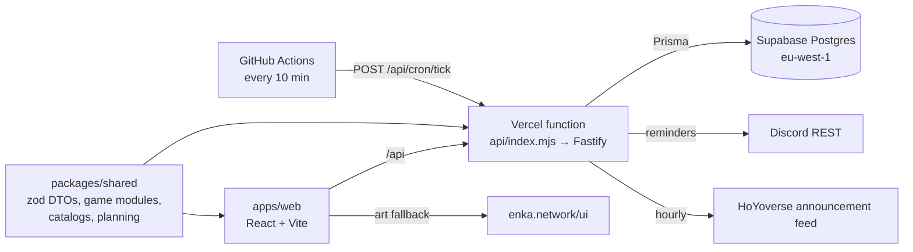

# gacha-hub — a cross-game gacha tracker

> Status: v1 live, iterating · Owner: Georges · Updated: 2026-10-05 · Language: TypeScript · Hosting: Vercel + Supabase + GitHub Actions · Live: https://gacha-hub-two.vercel.app

## 1. Summary

One place to run several gacha games at once: how many pulls you can afford, which dailies are left before reset, which characters you own and how far their builds are, what to farm today, and which banners and events are running. Discord sign-in, Discord DM reminders. Built for a handful of whitelisted friends plus a public demo; code is public (`adam-riffi/gacha-hub`).

## 2. Goals and non-goals

**Goals**
- Answer "what should I do in my games today?" in one screen (Home) and per game (the game page).
- Fast data entry: pick from a catalog, toggle, tick; almost never type.
- Free to run: Vercel Hobby, Supabase Free, GitHub Actions cron. No always-on process, no queue.
- Game data is accurate because it is imported, never hand-typed.

**Non-goals**
- A generic "build your own game" tracker; every game is hardcoded.
- Account sync through HoYoLAB or game logins (deferred; needs an owner decision, §14).
- Mobile layout and stamina (resin) tracking (dropped 2026-10-04).
- Monetization, public sign-up.

## 3. Users and demo story

A whitelisted player signs in with Discord, adds Genshin and HSR, sets currencies and ticks owned characters. Home shows pulls across games, today's dailies, current banners with the featured units they own, and goals. The Genshin page shows what is happening now, the to-do list and which domains are open today for the characters they own. A Discord DM arrives an hour before reset if dailies are left.

## 4. Scope

**v1 (shipped)**
- Games: Genshin, HSR, WuWa (catalog, builds, planner); Endfield (catalog for ownership only); ZZZ (currencies and dailies, no catalog).
- Profiles per game with region-aware resets; currencies and pull counts; sleep a game.
- Ownership roster; catalog-backed builds with bespoke per-game sheets; gear bag and set planner (Genshin artifacts).
- Planning: material requirements, goal tasks with material subtasks, inventory as source of truth.
- Home: KPI strip, banners now, today, task board, pulls, coming up, wallet.
- Banners and events: admin uploads with audit log; Genshin and HSR official-feed import; calendar view.
- Discord: OAuth sign-in, slash commands, DM reminders before reset and at custom times (optionally listing today's domains).
- Pull log per banner type with pity and the 50/50 guarantee (ADR 0002); pity next to pulls on Home.
- Data export: everything a user entered as one JSON file (Settings → Download my data).

**Next (should)** — milestones in §9.

**Later**
- Public showcase pages; PWA; i18n through dataset text maps.

## 5. Architecture



The shared package owns the contracts: inputs are validated and outputs parsed through the same zod DTOs, so client types cannot drift. Catalog JSON loads lazily per game on both sides and is indexed once.

**Repository layout**
```
gacha/
├── apps/web/            # pages/, components/, games/<key>/ (bespoke sheets), lib/
├── apps/server/         # api/ (one file per resource), lib/ (pure core), scheduler/, discord/, games/
├── packages/shared/     # dto/, catalog/, planning/, games/<key>/ (definition + catalog.json)
├── prisma/              # schema.prisma, migrations/ (schema.sqlite.prisma is generated)
├── scripts/catalog/     # dataset importers (isolated install, not a workspace)
├── scripts/harness/     # end-to-end harnesses against the server bundle
├── api/index.mjs        # Vercel function entry
└── docs/                # DESIGN.md, ENGINEERING.md, AGENT_LOG.md, adr/, DEPLOY.md
```

## 6. Core design decisions

**Locked product decisions** (owner, 2026-09; not relitigated): every game is a bespoke module and sheet; Discord-only sign-in, admins listed in `ADMIN_DISCORD_IDS`; one profile per user per game, region defaults to EU; free hosting only; catalogs come from open datasets through `scripts/catalog`; hard limits on every number (`LIMITS`).

**Semantics that must not break**
- Inventory is the source of truth: a "Farm X" task stores the raw total; its progress is derived from `MaterialStock` at read time.
- Task generation is idempotent: `origin.sources[]` holds one entry per contributing goal; re-planning replaces it.
- Level ranges are caps (20 → 90); talent ranges are plain levels.
- Build documents are versioned (`docVersion`) and migrated lazily on read.
- "Farmable today" uses the game day: the region's weekday shifted by the daily reset hour.
- Reminders are idempotent per `(rule, firedFor)`; the cron may tick at any cadence.
- Admin payloads round-trip: export returns exactly what upload accepts; every admin write is audited.
- Catalog JSON is typed `unknown` behind `catalog.js` + `catalog.d.ts` shims (literal inference over 4 MB of JSON made `tsc` run out of memory).
- Official-feed rows use keys `hoyo-<annId>` (HSR warps: `hoyo-<annId>-<warp>`) and never overwrite admin rows. The feed randomly serves Asia, Europe or America clock values labelled +1; `settle` recovers Europe from any two observations (6, 7 or 13 hours apart).

**Hand-written core** (pure, unit tested): per-game definitions and limits; reset math (`lib/resets.ts`); game day and domains today (`packages/shared/src/domains.ts`); reminder due logic (`scheduler/due.ts`); planning and cost math (`packages/shared/src/planning`); currency and pull math; official-feed parsing (`lib/officialFeed.ts`); pity and guarantee (`packages/shared/src/pity.ts`); build-document migrations.

**Allowed libraries**: React, React Router, TanStack Query, Vite; Fastify and its first-party plugins (cookie, oauth2, rate-limit, multipart, static); Prisma; zod and zod-to-json-schema; luxon; discord-interactions; `@vercel/blob`; node-cron (always-on hosts only); Vitest, fast-check, Playwright, ESLint, Prettier, esbuild, tsx. Importers may use their dataset packages (`genshin-db`, `adm-zip`) inside `scripts/catalog` only.

## 7. Visual identity

Dark, flat and sharp: radius 0, no shadows, flat elevated surfaces (`--bg`, `--bg-elev`, `--surface`). Display type is Space Grotesk; body is the system stack. Each game reskins accents with its own colour (Genshin gold, HSR violet, ZZZ yellow, WuWa sky blue, Endfield teal). Art leads where it exists: character portraits, 5★ gradients, ringed portraits for owned units. Icons are inline SVG. No mobile layout for now.

## 8. Data model and storage

Prisma models: `User`, `Session`, `GameInstance` (one per user per game; region, sleeping), `CurrencyState`, `Character` (build document JSON + `docVersion`), `Ownership`, `GearPiece` (unequipped pieces only), `Team`, `MaterialStock`, `Task` (recurring, goal, material subtasks), `ReminderRule`, `ReminderLog`, `Banner`, `Event`, `AuditLog`.

Postgres on Supabase (own project `gacha-hub`, eu-west-1; ADR 0001). Migrations are committed SQL under `prisma/migrations`, generated offline with `prisma migrate diff` and applied by `prisma migrate deploy` during the Vercel build. Row-level security is enabled on every table with no policies; the server connects as the table owner, and the Data API exposes nothing. Local development and tests use SQLite (`schema.sqlite.prisma` generated from the Postgres schema).

## 9. Development plan

| Milestone | Stack of PRs | Acceptance criteria |
| --- | --- | --- |
| P Process | standards and agent manual; DESIGN.md + ADR 0001; CI job names and hardening | `npm run check` green; CI jobs `lint`, `typecheck`, `test`, `build` |
| F1 Feed and calendar | #40 official feed + calendar; #41 game overview | Banners and events import hourly; game page shows today's domains |
| F2 Domain core | move game-day and domains-today logic into `packages/shared`, tested; server and web share it | One implementation, property-tested across regions and reset hours |
| F3 Farm-today DM | reminder option "domains open today" listing the open domains your owned units level from | With the option on, a reminder at any time (e.g. 09:00) carries the line; the line is left out when nothing you own needs an open domain |
| F4 HSR feed | per-section warp parsing for HSR notices | Each warp in a notice becomes its own banner with its own dates |
| F5 Pull log | pure pity core + banner rules (ADR 0002); `PullEntry` table and routes; game-page pull log and pity on Home | Pity matches a recorded history fixture; Home shows pity next to pulls |
| P2 Production smoke | `scripts/smoke.mjs` + `smoke.yml` on production deployments | A wrong or dev-login deployment fails the check; production passes |
| F6 Data export | `GET /api/export` (everything the user entered) + a Settings download | The export round-trips every user-owned table and contains nothing of other users or secrets |
| F7 Calendar history | ended banners/events load when paging back | Paging back two weeks shows what ended then |

F5 follows the owner's listed nice-to-have (HANDOFF.md §10) under ADR 0002 (Proposed); account import still needs the owner's go-ahead (§14).

## 10. Testing strategy

- **Unit:** pure core in §6: resets and game day, reminder due logic, planning math, currency math, feed parsing, document migrations.
- **Property:** game-day math across all regions, offsets and reset hours, against a luxon reference (`domains.test.ts`, seeded).
- **Integration:** route tests build the real Fastify app over a throwaway SQLite database (`*.integration.test.ts`, run sequentially).
- **Harness:** `scripts/harness/phase7.mjs` and `phase8.mjs` exercise the built bundle end to end.
- **End-to-end:** Playwright `@smoke` journeys (`e2e/`) against the built app on a throwaway SQLite database, signed in with the dev login: Home, adding Genshin opens its overview, the calendar. Traces are uploaded when CI fails.
- Coverage: new core modules at least 90% of lines.

## 11. CI/CD

| Workflow | Trigger | Jobs |
| --- | --- | --- |
| `ci.yml` | PRs, pushes to `main` | `lint`, `typecheck`, `test`, `build`, `e2e` |
| `cron-tick.yml` | Every 10 min, `workflow_dispatch` | `tick`: reminders, and the hourly feed import |
| `smoke.yml` | Successful production deployment, `workflow_dispatch` | `smoke`: `scripts/smoke.mjs` against the production domain |

Required checks: `lint`, `typecheck`, `test`, `build`, `e2e`. Vercel builds each push (preview per PR, production on `main`) and runs migrations in the build.

## 12. Deployment and configuration

Vercel project `gacha-hub` (framework preset "Other", functions in `dub1` next to the database). Preview deployments are off for `stack/**` and `dependabot/**` branches (`vercel.json`): the Hobby plan allows 100 deployments a day, and restacking a stack redeploys every branch; CI and the E2E suite cover those PRs. Environment variables are set by the owner in Vercel (`.env.example` lists them): `DATABASE_URL` (transaction pooler), `DIRECT_DATABASE_URL`, `SESSION_SECRET`, `COOKIE_SECURE=true`, `APP_BASE_URL`, `DISCORD_*`, `ADMIN_DISCORD_IDS`, `CRON_SECRET`, `BLOB_READ_WRITE_TOKEN`, `DEV_LOGIN_ENABLED=false`. Never set `NODE_ENV`. GitHub secrets: `CRON_URL`, `CRON_SECRET`. Full steps: `docs/DEPLOY.md`.

**Smoke checks** (`npm run smoke -- <url>`, run by `smoke.yml` after every production deploy): the app shell loads; `/api/me` answers anonymously with `oauth: true, devLogin: false`; `/api/instances` refuses anonymous reads. Manually: sign-in reaches Home; a `cron-tick` run returns `ok: true`.

## 13. Performance, security and observability

- Initial JavaScript at most 200 KB gzipped; catalogs load lazily per game.
- Every view has loading, empty and error states.
- Inputs validated with zod at the boundary; admin routes rate-limited and audited; the cron endpoint requires `CRON_SECRET`.
- No secrets in the client bundle; credentials are entered by the owner only.

## 14. Risks and open questions

- Enka (Genshin) and Yatta (HSR) art is hotlinked; mirror into our own store (`VITE_ASSET_BASE`) if either blocks us.
- The HoYoverse feed is undocumented and serves inconsistent times; imports fail soft and the admin can edit rows.
- Account import (Enka showcase, HoYoLAB) was deferred by the owner; needs a decision and an ADR before any work.
- `docs/HANDOFF.md` and `docs/DESIGN-*.md` predate this file; this file wins where they differ.

## 15. Definition of done

- [ ] Reminders deliver a DM in production.
- [ ] Every milestone in §9 merged with its acceptance criteria met.
- [ ] README follows ENGINEERING.md §15 with a demo GIF.
