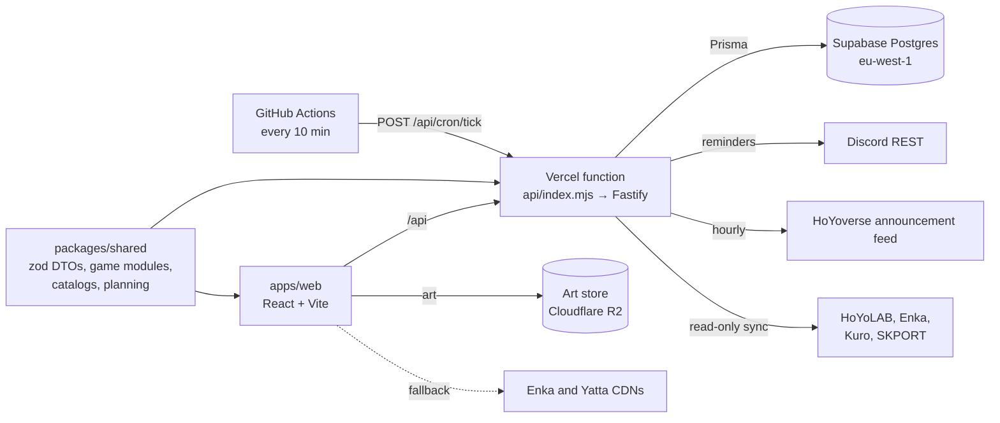

# gacha-hub — a cross-game gacha tracker

> Status: v1 live, iterating · Owner: Georges · Updated: 2026-10-09 · Language: TypeScript · Hosting: Vercel + Supabase + GitHub Actions · Live: https://gacha-hub-two.vercel.app

## 1. Summary

One place to run several gacha games at once: how many pulls you can afford, which dailies are left before reset, which characters you own and how far their builds are, what to farm today, and which banners and events are running. Discord sign-in, Discord DM reminders. Built for a handful of whitelisted friends plus a public demo; code is public (`adam-riffi/gacha-hub`).

## 2. Goals and non-goals

**Goals**
- Answer "what should I do in my games today?" in one screen (Home) and per game (the game page).
- Fast data entry: pick from a catalog, toggle, tick; almost never type.
- Free to run: Vercel Hobby, Supabase Free, GitHub Actions cron. No always-on process, no queue.
- Game data is accurate because it is imported, never hand-typed.
- Account data fills in automatically wherever a source allows it (ADR 0005); manual entry works everywhere else.

**Non-goals**
- A generic "build your own game" tracker; every game is hardcoded (ADR 0004 standardizes what each module declares).
- Writing to game accounts: no check-in, no code redemption. Linking is read-only (ADR 0005).
- A mobile-first layout; screens collapse to one column, nothing more.
- Monetization, public sign-up.

## 3. Users and demo story

A whitelisted player signs in with Discord, adds Genshin and HSR, sets currencies and ticks owned characters. Home shows pulls across games, today's dailies, current banners with the featured units they own, and goals. The Genshin page shows what is happening now, the to-do list and which domains are open today for the characters they own. A Discord DM arrives an hour before reset if dailies are left.

## 4. Scope

**v1 (shipped)**
- Games: Genshin, HSR, WuWa (catalog, builds, planner); Endfield (catalog for ownership only); ZZZ (currencies and dailies, no catalog).
- Profiles per game with region-aware resets; currencies and pull counts; sleep a game.
- Ownership roster; catalog-backed builds with bespoke per-game sheets; gear bag and set planner (Genshin artifacts).
- Planning: material requirements, goal tasks with material subtasks, inventory as source of truth.
- Home: KPI strip, banners now, today, task board, pulls, coming up, wallet.
- Banners and events: admin uploads with audit log; Genshin and HSR official-feed import; calendar view.
- Discord: OAuth sign-in, slash commands, DM reminders before reset and at custom times (optionally listing today's domains).
- Pull log per banner type with pity and the 50/50 guarantee (ADR 0002); pity next to pulls on Home.
- Data export: everything a user entered as one JSON file (Settings → Download my data).

**Next (should)** — the screens in `docs/WIREFRAMES.md` (wireframed 2026-10-09), delivered by milestones V and F8–F12 in §9:
- The look of the 2026-10-08 dashboard on every screen (`docs/VISUAL-DESIGN.md`, ADR 0007).
- Activities on five cadences (daily, weekly, monthly, endgame cycle, version); stamina with its reserve, back in scope; battle pass, 30-day pass and monthly shops.
- Endgame modes with a history per cycle.
- Pulls: 5★ and 4★ odds, guarantee status, savings planner with chances.
- Characters: splash-art cards with role-based KPIs (crit value, energy recharge, elemental mastery, healing); a character sheet with the art on the left.
- Calendar: banners and events by default; event rewards (a free 4★, an event weapon) become goals that update constellation or refinement.
- Account linking and imports (ADR 0005); game art in our own store (ADR 0006); a game manifest and a pipeline for new games, starting with Neverness to Everness (ADR 0004).

**Later**
- Public showcase pages; PWA; i18n through dataset text maps.

## 5. Architecture



The shared package owns the contracts: inputs are validated and outputs parsed through the same zod DTOs, so client types cannot drift. Catalog JSON loads lazily per game on both sides and is indexed once.

**Repository layout**
```
gacha/
├── apps/web/            # pages/, components/, games/<key>/ (bespoke sheets), lib/
├── apps/server/         # api/ (one file per resource), lib/ (pure core), scheduler/, discord/, games/
├── packages/shared/     # dto/, catalog/, planning/, games/<key>/ (definition + catalog.json)
├── prisma/              # schema.prisma, migrations/ (schema.sqlite.prisma is generated)
├── scripts/catalog/     # dataset importers (isolated install, not a workspace)
├── scripts/harness/     # end-to-end harnesses against the server bundle
├── scripts/assets/      # art mirror to the art store (isolated install, ADR 0006)
├── api/index.mjs        # Vercel function entry
└── docs/                # DESIGN.md, WIREFRAMES.md, VISUAL-DESIGN.md, design/, games/<key>.md, ENGINEERING.md, AGENT_LOG.md, PROJECT-GUIDE.md, screens/, adr/, DEPLOY.md
```

## 6. Core design decisions

**Locked product decisions** (owner, 2026-09; not relitigated): every game is a bespoke module and sheet; Discord-only sign-in, admins listed in `ADMIN_DISCORD_IDS`; one profile per user per game, region defaults to EU; free hosting only; catalogs come from open datasets through `scripts/catalog`; hard limits on every number (`LIMITS`). ADR 0004 keeps the first one: each module declares a typed manifest in code.

**Semantics that must not break**
- Inventory is the source of truth: a "Farm X" task stores the raw total; its progress is derived from `MaterialStock` at read time.
- Task generation is idempotent: `origin.sources[]` holds one entry per contributing goal; re-planning replaces it.
- Level ranges are caps (20 → 90); talent ranges are plain levels.
- Build documents are versioned (`docVersion`) and migrated lazily on read.
- "Farmable today" uses the game day: the region's weekday shifted by the daily reset hour.
- Reminders are idempotent per `(rule, firedFor)`; the cron may tick at any cadence.
- Admin payloads round-trip: export returns exactly what upload accepts; every admin write is audited.
- Catalog JSON is typed `unknown` behind `catalog.js` + `catalog.d.ts` shims (literal inference over 4 MB of JSON made `tsc` run out of memory).
- Official-feed rows use keys `hoyo-<annId>` (HSR warps: `hoyo-<annId>-<warp>`) and never overwrite admin rows. The feed randomly serves Asia, Europe or America clock values labelled +1; `settle` recovers Europe from any two observations (6, 7 or 13 hours apart).

**Hand-written core** (pure, unit tested): per-game definitions and limits; reset math (`lib/resets.ts`); game day and domains today (`packages/shared/src/domains.ts`); reminder due logic (`scheduler/due.ts`); planning and cost math (`packages/shared/src/planning`); currency and pull math; official-feed parsing (`lib/officialFeed.ts`); pity and guarantee (`packages/shared/src/pity.ts`); build-document migrations; cadence windows (`packages/shared/src/cadence.ts`); pull odds (`packages/shared/src/odds.ts`); stamina projection; import parsers (UIGF, convene records); token encryption.

**Allowed libraries**: React, React Router, TanStack Query, Vite; Fastify and its first-party plugins (cookie, oauth2, rate-limit, multipart, static); Prisma, with its driver adapters from milestone D (ADR 0003); zod; luxon; discord-interactions; `@vercel/blob`; node-cron (always-on hosts only); Vitest, fast-check, Playwright, ESLint, Prettier, esbuild, tsx. Importers may use their dataset packages (`genshin-db`, `adm-zip`) inside `scripts/catalog` only. Token encryption uses `node:crypto` (built in). The art mirror may use `sharp` and an S3 client inside `scripts/assets` only (ADR 0006).

## 7. Visual identity

An industrial HUD from Georges's 2026-10-08 dashboard design; the full system is `docs/VISUAL-DESIGN.md` (ADR 0007). A near-black page with flat, opaque, square panels: graphs float on the page between corner marks, content sits on `#121212` cards clamped by a corner brace. Type: Barlow Condensed for titles and figures, IBM Plex Mono for labels and numbers, Hanken Grotesk for body text, Bodoni Moda for banner titles only; all self-hosted. One accent carries the data and the current state: magenta `#FF2D95` on the Overview, the game's colour on a game, the character's element colour on a character's pages. Urgency is a paper-white chip, never a colour. Charts are hand-written SVG with a layered tilt on hover; icons are inline SVG. Art leads where it exists: splash art on character cards and in the left column of the character sheet. Desktop first, no separate mobile design yet. Screen structure follows `docs/WIREFRAMES.md`.

## 8. Data model and storage

Prisma models: `User`, `Session`, `GameInstance` (one per user per game; region, sleeping, UID, account level), `CurrencyState`, `Character` (build document JSON + `docVersion`), `Ownership`, `GearPiece` (unequipped pieces only), `Team`, `MaterialStock`, `Task` (recurring on five cadences, goal, material subtasks; a monthly or cycle task follows a manifest entry by `anchorKey`), `CycleResult` (one row per endgame mode and cycle: result, detail, premium earned, teams, source), `PassState` (battle pass or 30-day pass: level, weekly XP, end date, source), `DayRecord` (a profile's game day: dailies done and total, open backlog, pulls on hand), `ReminderRule`, `ReminderLog`, `Banner`, `Event`, `AuditLog`.

Postgres on Supabase (own project `gacha-hub`, eu-west-1; ADR 0001). Migrations are committed SQL under `prisma/migrations`, generated offline with `prisma migrate diff` and applied by `prisma migrate deploy` during the Vercel build. Row-level security is enabled on every table with no policies; the server connects as the table owner, and the Data API exposes nothing. Local development and tests use SQLite (`schema.sqlite.prisma` generated from the Postgres schema).

**Planned (F10–F12):** `WishlistItem`, and `LinkedAccount` and `ImportRun` (ADR 0005); `PullEntry` gains `source` and the game's record id for deduplication. Every new table enables RLS in its migration. Exact columns are settled in each milestone's PRs.

## 9. Development plan

| Milestone | Stack of PRs | Acceptance criteria |
| --- | --- | --- |
| P Process | standards and agent manual; DESIGN.md + ADR 0001; CI job names and hardening | `npm run check` green; CI jobs `lint`, `typecheck`, `test`, `build` |
| F1 Feed and calendar | #40 official feed + calendar; #41 game overview | Banners and events import hourly; game page shows today's domains |
| F2 Domain core | move game-day and domains-today logic into `packages/shared`, tested; server and web share it | One implementation, property-tested across regions and reset hours |
| F3 Farm-today DM | reminder option "domains open today" listing the open domains your owned units level from | With the option on, a reminder at any time (e.g. 09:00) carries the line; the line is left out when nothing you own needs an open domain |
| F4 HSR feed | per-section warp parsing for HSR notices | Each warp in a notice becomes its own banner with its own dates |
| F5 Pull log | pure pity core + banner rules (ADR 0002); `PullEntry` table and routes; game-page pull log and pity on Home | Pity matches a recorded history fixture; Home shows pity next to pulls |
| P2 Production smoke | `scripts/smoke.mjs` + `smoke.yml` on production deployments | A wrong or dev-login deployment fails the check; production passes |
| F6 Data export | `GET /api/export` (everything the user entered) + a Settings download | The export round-trips every user-owned table and contains nothing of other users or secrets |
| F7 Calendar history | ended banners/events load when paging back | Paging back two weeks shows what ended then |
| V Visual system | tokens and self-hosted fonts; shell (rail, scope strip, top bar); panels, chips, buttons, lists and carousels; SVG chart parts; game accents; Home restyled (`docs/VISUAL-DESIGN.md`, ADR 0007) | Home at 1920×1204 matches the 2026-10-08 design, screenshot in the PR; a game scope changes only the accent; no serious axe violations; reduced motion turns off transitions and auto-rotation |
| D Prisma 7 | the Prisma-6-compatible prep (#79); `prisma.config.ts`, the `prisma-client` generator, driver adapters (`@prisma/adapter-pg` through the transaction pooler, `@prisma/adapter-better-sqlite3` locally) and the moved imports; verification on a disposable Postgres and a preview deployment (ADR 0003) | `npm run check`, the harnesses and E2E pass on Prisma 7; a preview deployment reads and writes Supabase through the pooler; production deploy and smoke green |
| F8 Cadences, endgame and passes | cadence core and manifest fields (ADR 0004); Activities tab; endgame modes with `CycleResult` history; battle pass and 30-day pass; stamina and reserve on Home and the game hub; Endfield regions and Sanity cap fixed | Each game shows its five cadences with correct countdowns in every region (property-tested); the Endgame tab lists past cycles; stamina "full at" matches the regeneration math |
| F9 Game pipeline | manifest type and conformance suite; `npm run game:new`; `docs/games/<key>.md` per game; NTE at capability M; ZZZ official feed | A scaffolded game passes the conformance suite; NTE works by hand on every screen |
| F10 Screens and build parity | the remaining screens in `docs/WIREFRAMES.md`: Home proposals, Library, Tasks with event goals, Calendar layers and reward goals, Pulls odds and guarantee, Characters splash cards and KPIs, character sheet, gear, planner, profile; gear blocks for every game | Each screen matches its section in WIREFRAMES.md, with loading, empty and error states; odds match a seeded simulation within 0.5 points |
| F11 Automatic data | `LinkedAccount` and encryption; HoYoLAB notes and chronicle sync; pull-history imports (history link, UIGF v4.2, WuWa convene, Endfield SKPORT); Enka showcase sync (ADR 0005) | Link, sync and revoke work end to end against recorded fixtures; tokens never appear in logs, responses or exports |
| F12 Art store | `splash` art kind; `scripts/assets` mirror to R2; CSP update (ADR 0006) | Every game shows art for owned characters from our store; a missing file falls back to the placeholder |

F5 follows the owner's listed nice-to-have (the Phase 8 handoff notes, in git history before 2026-10-08) under ADR 0002. Account import was approved on 2026-10-09 (ADR 0005). Each milestone ships its own screens; F10 covers the screens no earlier milestone owns. V and D come first, in either order: V so the later screens are built in the new look, D so the new tables start on Prisma 7. ADRs 0001–0007 were accepted on 2026-10-09.

## 10. Testing strategy

- **Unit:** pure core in §6: resets and game day, reminder due logic, planning math, currency math, feed parsing, document migrations.
- **Property:** game-day math across all regions, offsets and reset hours, against a luxon reference (`domains.test.ts`, seeded). Cadence windows across regions and the viewer's daylight-saving changes; odds distributions sum to 1 and match a seeded simulation.
- **Conformance:** one suite runs over every registered game module (ADR 0004).
- **Integration:** route tests build the real Fastify app over a throwaway SQLite database (`*.integration.test.ts`, run sequentially).
- **Harness:** `scripts/harness/phase7.mjs` and `phase8.mjs` exercise the built bundle end to end.
- **End-to-end:** Playwright `@smoke` journeys (`e2e/`) against the built app on a throwaway SQLite database, signed in with the dev login: Home, adding Genshin opens its overview, the calendar. Traces are uploaded when CI fails.
- Coverage: new core modules at least 90% of lines.

## 11. CI/CD

| Workflow | Trigger | Jobs |
| --- | --- | --- |
| `ci.yml` | PRs, pushes to `main` | `lint`, `typecheck`, `test`, `test-postgres` (the route tests on a Postgres service), `build`, `e2e` |
| `cron-tick.yml` | Every 10 min, `workflow_dispatch` | `tick`: reminders, and the hourly feed import |
| `smoke.yml` | Successful production deployment, `workflow_dispatch` | `smoke`: `scripts/smoke.mjs` against the production domain |

Required checks: `lint`, `typecheck`, `test`, `build`, `e2e`. Vercel builds each push (preview per PR, production on `main`) and runs migrations in the build.

## 12. Deployment and configuration

Vercel project `gacha-hub` (framework preset "Other", functions in `dub1` next to the database). Preview deployments are off for `stack/**`, `spike/**` and `dependabot/**` branches (`vercel.json`): the Hobby plan allows 100 deployments a day, and restacking a stack redeploys every branch; CI and the E2E suite cover those PRs. Environment variables are set by the owner in Vercel (`.env.example` lists them): `DATABASE_URL` (transaction pooler), `DIRECT_DATABASE_URL`, `SESSION_SECRET`, `COOKIE_SECURE=true`, `APP_BASE_URL`, `DISCORD_*`, `ADMIN_DISCORD_IDS`, `CRON_SECRET`, `BLOB_READ_WRITE_TOKEN`, `DEV_LOGIN_ENABLED=false`; from F11 `LINK_SECRET_KEY` (ADR 0005); from F12 `VITE_ASSET_BASE` (ADR 0006). Never set `NODE_ENV`. GitHub secrets: `CRON_URL`, `CRON_SECRET`. Full steps: `docs/DEPLOY.md`.

**Smoke checks** (`npm run smoke -- <url>`, run by `smoke.yml` after every production deploy): the app shell loads; `/api/health` reads through the database; `/api/me` answers anonymously with `oauth: true, devLogin: false`; `/api/instances` refuses anonymous reads; the security headers are sent. Manually: sign-in reaches Home; a `cron-tick` run returns `ok: true`.

## 13. Performance, security and observability

- Initial JavaScript at most 200 KB gzipped (`npm run budget`, enforced in CI's `build` job; 149 KB on 2026-10-06); catalogs load lazily per game.
- Every view has loading, empty and error states.
- Inputs validated with zod at the boundary; admin routes rate-limited and audited; the cron endpoint requires `CRON_SECRET`.
- No secrets in the client bundle; credentials are entered by the owner only.
- Linked-account tokens are encrypted at rest (AES-256-GCM, `LINK_SECRET_KEY`), never logged, never sent to the browser and never exported (ADR 0005).
- Every response carries a Content-Security-Policy (own scripts only; images from the app, Enka, Yatta, Discord avatars, Vercel Blob and, from F12, the art store), `frame-ancestors 'none'`, `nosniff`, a strict referrer policy and a minimal permissions policy (`apps/server/src/lib/securityHeaders.ts`, mirrored in `vercel.json`).

## 14. Risks and open questions

- Art moves to our own store in F12 (ADR 0006); until then Enka (Genshin) and Yatta (HSR) are hotlinked.
- The HoYoverse feed is undocumented and serves inconsistent times; imports fail soft and the admin can edit rows.
- Account import (ADR 0005) relies on undocumented endpoints and on HoYoverse tolerating read-only tools; every import fails soft.
- Events and rewards as data with typed effects (ADR 0008, Proposed): decide before F10.
- Pull odds follow the community model of soft pity; they are estimates and the UI says so.
- Endfield's weekly, monthly, endgame and pass rules are still to research before its manifest is complete.
- `docs/DESIGN-BRIEF.md` and `docs/DESIGN-HANDOFF.md` predate this file and `docs/VISUAL-DESIGN.md`; those two win where they differ. `docs/PROJECT-GUIDE.md` walks through the shipped screens and per-game features; this file wins on scope.

## 15. Definition of done

- [ ] Reminders deliver a DM in production.
- [ ] Every milestone in §9 merged with its acceptance criteria met.
- [ ] README follows ENGINEERING.md §15 with a demo GIF.
