# gacha-hub: project guide

> Written 2026-10-08 (claude) against `main` at `36edfc0`. A full picture of the project for whoever picks it up next: what it is for, every screen, why each game has its own features, how the pieces fit, and everything left to do.
>
> **How it relates to the other docs.** `HANDOFF.md` (repository root, about 60 lines) is the short session-to-session state and is rewritten every session. `docs/DESIGN.md` is the specification and wins on scope. `docs/AGENT_LOG.md` is the history, one entry per PR. This guide is the long version: refresh its "Work state" (§13) and "To do" (§14) sections when they drift, and the screenshots when a screen changes.

## Contents

1. [TL;DR](#1-tldr)
2. [What it is: purpose, goals, scope](#2-what-it-is-purpose-goals-scope)
3. [Live system and environments](#3-live-system-and-environments)
4. [Architecture](#4-architecture)
5. [Data model](#5-data-model)
6. [Key flows](#6-key-flows)
7. [Screen map](#7-screen-map)
8. [Screen by screen](#8-screen-by-screen)
9. [Game-specific features](#9-game-specific-features)
10. [Cross-cutting features](#10-cross-cutting-features)
11. [API map](#11-api-map)
12. [Process and quality gates](#12-process-and-quality-gates)
13. [Work state](#13-work-state)
14. [To do](#14-to-do)
15. [Known issues](#15-known-issues)
16. [Gotchas](#16-gotchas)
17. [Reference: docs, ADRs, glossary](#17-reference-docs-adrs-glossary)

---

## 1. TL;DR

- **What:** a tracker for people who play several gacha games at once (Genshin Impact, Honkai: Star Rail, Zenless Zone Zero, Wuthering Waves, Arknights: Endfield, Neverness to Everness). It answers "what should I do in my games today?": pulls I can afford, dailies left before reset, which characters I own and how far their builds are, what to farm today, which banners and events are running. Discord sign-in and Discord DM reminders.
- **Who:** a handful of whitelisted friends plus a public demo. Code is public: `adam-riffi/gacha-hub`. Owner: Georges.
- **Where:** live at https://gacha-hub-two.vercel.app (Vercel Hobby + Supabase Postgres eu-west-1 + GitHub Actions as the cron).
- **State:** every milestone in `docs/DESIGN.md` §9 is built, V through F12. CI, the production smoke check and the security headers are in place.
- **What blocks "done":** secrets only the owner can set: `CRON_SECRET` (reminders, the feed import and the HoYoLAB sync), `LINK_SECRET_KEY` (linking), the R2 bucket (our art store) and the Discord bot (§14.1).
- **Next agent work:** §14.2.

## 2. What it is: purpose, goals, scope

### The problem

Someone playing four or five gacha games juggles separate daily resets, separate premium currencies, separate pity counters, and separate "which domain is open today" calendars. Each game's own UI only knows about itself, and the planning information (how many materials a level-90 character needs, which weekday a talent book drops) lives in wikis. gacha-hub puts all of it in one place and reduces data entry to picking from catalogs and ticking boxes.

### Goals (DESIGN.md §2)

- Answer "what should I do in my games today?" in one screen (**Home**) and per game (the **game page**).
- Fast data entry: pick from a catalog, toggle, tick; almost never type.
- Free to run: Vercel Hobby, Supabase Free, GitHub Actions cron. No always-on process, no queue.
- Game data is accurate because it is imported from open datasets, never hand-typed.

### Non-goals

- A generic "build your own game" tracker. Every game is hardcoded (locked decision).
- Account sync through HoYoLAB, Enka or game logins (deferred; needs an owner decision and an ADR).
- Mobile layout and stamina (resin) tracking: dropped by the owner on 2026-10-04. The resin bar on Home and the `/resin` bot command predate that and stay as they are; do not extend them.
- Monetization, public sign-up.

### Locked product decisions (do not relitigate)

Every game is a bespoke module and sheet · Discord-only sign-in, admins listed in `ADMIN_DISCORD_IDS` · one profile per user per game, region defaults to EU · free hosting only · catalog data comes from the importer pipeline, never typed by hand · hard limits on every number (`LIMITS` in `packages/shared/src/common.ts`).

### Shipped scope (v1)

| Area | What ships |
| --- | --- |
| Games | Genshin, HSR, WuWa, ZZZ (catalog, builds, planner); Endfield (catalog for ownership only); NTE (by hand only: its terms forbid third-party tools) |
| Profiles | One per game, region-aware resets, currencies and pull counts, "put to sleep" |
| Roster | Ownership grid; catalog-backed builds with a bespoke sheet per game; several named builds per character |
| Gear | Genshin artifacts: set browser, inventory bag with equip/unequip, farming planner. Other games: set browser |
| Planning | Material requirements from catalog costs, goal tasks with material subtasks, inventory as source of truth |
| Home | KPI strip, banners now, Today, task board, pulls with pity, coming up, wallet |
| Banners and events | Admin JSON uploads with audit log; Genshin and HSR official-feed import; calendar with paging back into history |
| Discord | OAuth sign-in, 10 slash commands, DM reminders before reset and at chosen times, optional "domains open today" line |
| Pull log | Per banner type with pity and the 50/50 guarantee (ADR 0002) |
| Export | Everything a user entered as one JSON file |

## 3. Live system and environments

| Thing | Value |
| --- | --- |
| Production URL | https://gacha-hub-two.vercel.app (auto-deploys `main`) |
| Repository | https://github.com/adam-riffi/gacha-hub (public) |
| Vercel | team `Wuxinggraph` (`team_TQggk8RvXbuHw2YtnZ4kbouw`), project `gacha-hub` (`prj_mKfaViC5ARkgBz2TRjyk1xRRz6tN`), framework preset **Other**, functions in `dub1`, Blob store `gacha-hub-uploads` |
| Supabase | project `gacha-hub`, ref `fmacvvwhvnhyncpkaimi`, eu-west-1; pooler host `aws-0-eu-west-1`; RLS on every table, no policies |
| Migrations | 9, applied by `prisma migrate deploy` inside the Vercel build |
| Cron | `.github/workflows/cron-tick.yml` every 10 minutes → `POST /api/cron/tick` |
| Smoke | `.github/workflows/smoke.yml` after each production deployment (last: success on `36edfc0`, 2026-10-07) |

**Environment variables** (owner enters them; `.env.example` lists them; never set `NODE_ENV` on Vercel):

| Variable | Purpose | Production status (2026-10-08) |
| --- | --- | --- |
| `DATABASE_URL`, `DIRECT_DATABASE_URL` | pooled and direct Postgres | set |
| `SESSION_SECRET`, `COOKIE_SECURE=true`, `APP_BASE_URL` | sessions | set |
| `DISCORD_CLIENT_ID`, `DISCORD_CLIENT_SECRET`, `DISCORD_OAUTH_REDIRECT` | web sign-in | set (`/api/me` reports `oauth: true`) |
| `DISCORD_APP_ID`, `DISCORD_PUBLIC_KEY` | bot interactions | check |
| `DISCORD_BOT_TOKEN` | sending DMs, registering commands | **not set** |
| `ADMIN_DISCORD_IDS` | who sees Admin | set |
| `CRON_SECRET` (Vercel) | guards `/api/cron/tick` | unknown: set it together with the GitHub one |
| `BLOB_READ_WRITE_TOKEN` | image uploads | injected by the Blob store |
| `DEV_LOGIN_ENABLED=false` | dev shortcut off | set (`devLogin: false`) |
| GitHub secrets `CRON_URL`, `CRON_SECRET` | the tick workflow | `CRON_URL` set, **`CRON_SECRET` empty**: every tick logs "secrets not set; skipping" |

**Production data** (checked during the 2026-10-07 audit): Banner and Event tables hold only the "Seed sample data" rows (2 per game, from 2026-10-04) and no `hoyo-` feed rows; `PullEntry` exists and is empty.

**Local:** `npm ci`, `npm run db:sqlite`, `npm run dev` (web :5173, API :3000), then "Continue as Dev User". Add `ADMIN_DISCORD_IDS=dev-local-user` to `.env` to see Admin. Local and test databases are SQLite; Docker's Linux engine does not start on the owner's machine, so Postgres is never run locally.

## 4. Architecture

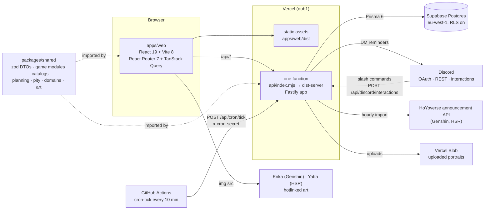
```mermaid
flowchart LR
  subgraph Browser
    W["apps/web<br/>React 19 + Vite 8<br/>React Router 7 + TanStack Query"]
  end
  subgraph Vercel["Vercel (dub1)"]
    STATIC["static assets<br/>apps/web/dist"]
    F["one function<br/>api/index.mjs → dist-server<br/>Fastify app"]
  end
  S["packages/shared<br/>zod DTOs · game modules · catalogs<br/>planning · pity · domains · art"]
  DB[("Supabase Postgres<br/>eu-west-1, RLS on")]
  GH["GitHub Actions<br/>cron-tick every 10 min"]
  DC["Discord<br/>OAuth · REST · interactions"]
  HOYO["HoYoverse announcement API<br/>(Genshin, HSR)"]
  ART["Enka (Genshin) · Yatta (HSR)<br/>hotlinked art"]
  BLOB["Vercel Blob<br/>uploaded portraits"]

  W -- "/api/*" --> F
  W --> STATIC
  S -. imported by .-> W
  S -. imported by .-> F
  F -- Prisma 6 --> DB
  GH -- "POST /api/cron/tick<br/>x-cron-secret" --> F
  F -- "DM reminders" --> DC
  DC -- "slash commands<br/>POST /api/discord/interactions" --> F
  F -- "hourly import" --> HOYO
  W -- "img src" --> ART
  F -- uploads --> BLOB
```

- **One contract.** `packages/shared` owns every request and response shape as zod schemas. The server validates inputs and parses its outputs through the same schemas, so the web types (`z.infer`) cannot drift.
- **Catalogs** are normalized JSON per game (`packages/shared/src/games/<key>/catalog.json`, about 4 MB for Genshin), loaded lazily per game on both sides and indexed once. They are typed `unknown` behind `catalog.js` + `catalog.d.ts` shims because literal inference over the JSON ran `tsc` out of memory.
- **Pure core** (unit and property tested, no I/O): reset math (`apps/server/src/lib/resets.ts`), game day and domains today (`packages/shared/src/domains.ts`), reminder due logic (`apps/server/src/scheduler/due.ts`), planning and cost math (`packages/shared/src/planning`), currency and pull math (`apps/server/src/lib/currencies.ts`), pity (`packages/shared/src/pity.ts`), feed parsing (`apps/server/src/lib/officialFeed.ts`), build-document migrations (`apps/server/src/lib/docMigrations.ts`).
- **Serverless.** Production is one Vercel function plus static files. `api/index.mjs` imports the esbuild bundle in `dist-server/` (ESM; a `.ts` entry compiled to CJS crashed with `ERR_REQUIRE_ESM`). `apps/server/src/index.ts` is the always-on entry for local dev and E2E.
- **Security headers** on every response: CSP (own scripts; images from the app, Enka, Yatta, Discord avatars, Vercel Blob), `frame-ancestors 'none'`, `nosniff`, strict referrer and permissions policies. Defined in `apps/server/src/lib/securityHeaders.ts`, mirrored in `vercel.json` for static files, and a test keeps the two equal.

**Repository layout**

```
gacha/
├── apps/web/src/          pages/ (one per route), components/, games/<key>/Sheet.tsx, lib/ (api, auth, catalog, time, toast)
├── apps/server/src/       api/ (one file per resource + *.integration.test.ts), lib/ (pure core), scheduler/, discord/, games/ (server hooks), auth/
├── packages/shared/src/   dto/, catalog/, planning/, games/<key>/ (definition + limits + catalog), domains.ts, pity.ts, art.ts, common.ts
├── prisma/                schema.prisma, migrations/ (schema.sqlite.prisma is generated)
├── scripts/               catalog/ (importers, isolated install), harness/, smoke.mjs, budget.mjs, e2e-server.mjs, vercel-build.mjs
├── e2e/                   Playwright journeys
├── api/index.mjs          Vercel function entry
└── docs/                  DESIGN.md, ENGINEERING.md, AGENT_LOG.md, PROJECT-GUIDE.md, screens/, adr/, DEPLOY.md
```

## 5. Data model


```mermaid
erDiagram
  User ||--o{ Session : "signs in"
  User ||--o{ GameInstance : "one per game"
  User ||--o{ ReminderRule : owns
  GameInstance ||--o{ CurrencyState : "per currency key"
  GameInstance ||--o{ Ownership : "catalog ids owned"
  GameInstance ||--o{ Character : "builds (JSON doc + docVersion)"
  GameInstance ||--o{ GearPiece : "unequipped pieces"
  GameInstance ||--o{ Team : "party presets"
  GameInstance ||--o{ MaterialStock : "have counts"
  GameInstance ||--o{ Task : "dailies, goals, material subtasks"
  GameInstance ||--o{ PullEntry : "pull log"
  ReminderRule ||--o{ ReminderLog : "unique (rule, firedFor)"
  User ||--o{ AuditLog : "admin writes"
  Banner {
    string gameKey
    string key "feed or admin key"
    string kind
    json featured
  }
  Event {
    string gameKey
    string key
  }
```

Games are code, not a table (`packages/shared/src/games`): `GameInstance`, `Banner` and `Event` rows carry a `gameKey`, and banners and events are shared by every user. Semantics that must not break are in §16.

## 6. Key flows

### Official feed → banners and events

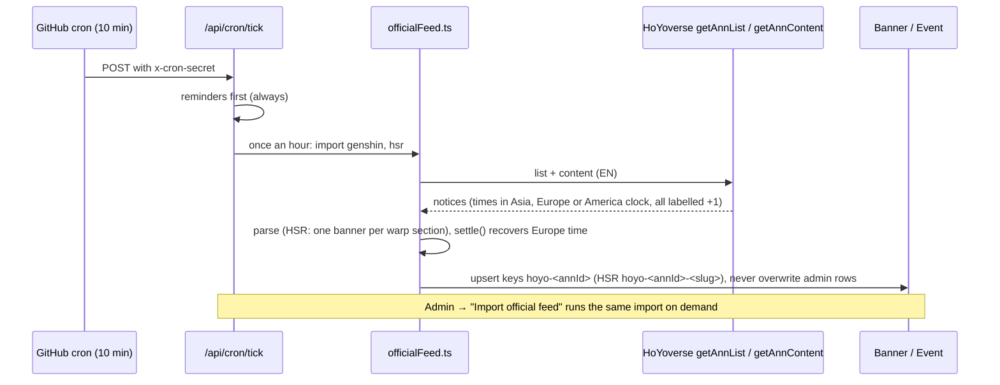
```mermaid
sequenceDiagram
  participant GH as GitHub cron (10 min)
  participant API as /api/cron/tick
  participant FEED as officialFeed.ts
  participant HOYO as HoYoverse getAnnList / getAnnContent
  participant DB as Banner / Event
  GH->>API: POST with x-cron-secret
  API->>API: reminders first (always)
  API->>FEED: once an hour: import genshin, hsr
  FEED->>HOYO: list + content (EN)
  HOYO-->>FEED: notices (times in Asia, Europe or America clock, all labelled +1)
  FEED->>FEED: parse (HSR: one banner per warp section), settle() recovers Europe time
  FEED->>DB: upsert keys hoyo-<annId> (HSR hoyo-<annId>-<slug>), never overwrite admin rows
  Note over API,DB: Admin → "Import official feed" runs the same import on demand
```

### Reminders

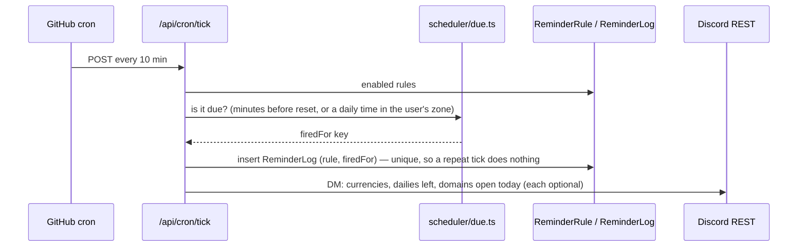
```mermaid
sequenceDiagram
  participant GH as GitHub cron
  participant API as /api/cron/tick
  participant DUE as scheduler/due.ts
  participant DB as ReminderRule / ReminderLog
  participant D as Discord REST
  GH->>API: POST every 10 min
  API->>DB: enabled rules
  API->>DUE: is it due? (minutes before reset, or a daily time in the user's zone)
  DUE-->>API: firedFor key
  API->>DB: insert ReminderLog (rule, firedFor) — unique, so a repeat tick does nothing
  API->>D: DM: currencies, dailies left, domains open today (each optional)
```

### Planning: from a goal to farmable tasks

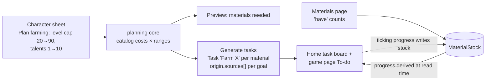
```mermaid
flowchart LR
  A["Character sheet<br/>Plan farming: level cap 20→90,<br/>talents 1→10"] --> B["planning core<br/>catalog costs × ranges"]
  B --> C["Preview: materials needed"]
  B --> D["Generate tasks<br/>Task 'Farm X' per material<br/>origin.sources[] per goal"]
  D --> E["Home task board +<br/>game page To-do"]
  F["Materials page<br/>'have' counts"] --> G[("MaterialStock")]
  G -- "progress derived at read time" --> E
  E -- "ticking progress writes stock" --> G
```

Inventory is the source of truth: a "Farm X" task stores the raw total; its progress is read from `MaterialStock`. Re-planning the same goal replaces its `origin.sources[]` entry, so generation is idempotent.

### Pull log and pity (ADR 0002)

A `PullEntry` is `{bannerType, count, fiveStar?, featured?}`. Pity is the count since the last 5★; the guarantee is on when the last 5★ was not the featured one. "Set pity" writes a zero-count calibration marker so people starting mid-pity do not have to replay history. Each game's `pullBanners` gives hard pity, the featured rate (50% character, 75% Genshin/HSR/ZZZ weapon, 100% WuWa weapon) and whether a guarantee exists.

## 7. Screen map

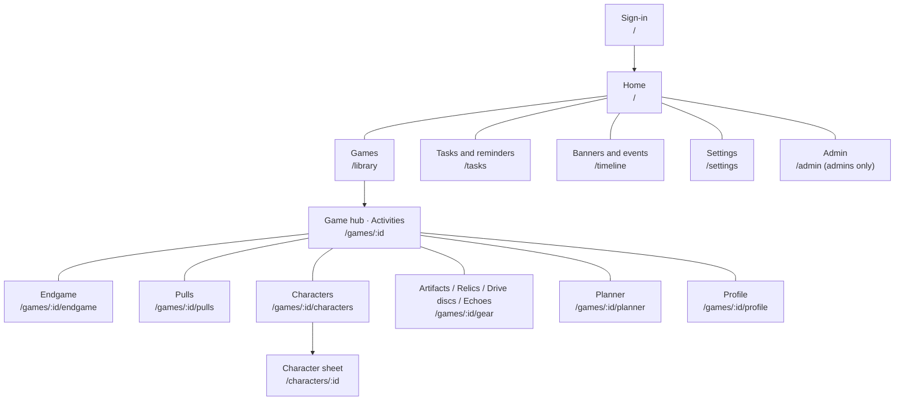
```mermaid
flowchart TB
  L["Sign-in<br/>/"] --> H["Home<br/>/"]
  H --- G["Games<br/>/library"]
  H --- T["Tasks and reminders<br/>/tasks"]
  H --- C["Banners and events<br/>/timeline"]
  H --- S["Settings<br/>/settings"]
  H --- AD["Admin<br/>/admin (admins only)"]
  G --> A["Game hub · Activities<br/>/games/:id"]
  A --- EG["Endgame<br/>/games/:id/endgame"]
  A --- PU["Pulls<br/>/games/:id/pulls"]
  A --- CH["Characters<br/>/games/:id/characters"]
  A --- GR["Artifacts / Relics / Drive discs / Echoes<br/>/games/:id/gear"]
  A --- PL["Planner<br/>/games/:id/planner"]
  A --- PR["Profile<br/>/games/:id/profile"]
  CH --> SH["Character sheet<br/>/characters/:id"]
```

The rail on the left is on every signed-in page: All (Home), Games, Tasks, Banners, then Admin (admins only) and Settings. The strip across the top scopes Home to one game or all of them, in the order set on the Games page.

The game hub's tabs depend on the game (§9):
- Pulls needs pull rules.
- Gear and Planner need a catalog with gear and costs, so Endfield and NTE have neither.

The old routes `/games/:id/overview` and `/games/:id/equipment` redirect to Profile and Characters. `/games/:id/ownership` and `/games/:id/materials` still answer but are no longer tabs.

## 8. Screen by screen

The screenshots come from the local dev build (dev user, SQLite) on 2026-10-10, at 1440×900. Images from outside the app are blocked, so cards show their placeholders and no game art sits in the repository (ADR 0006).

### 8.1 Sign-in

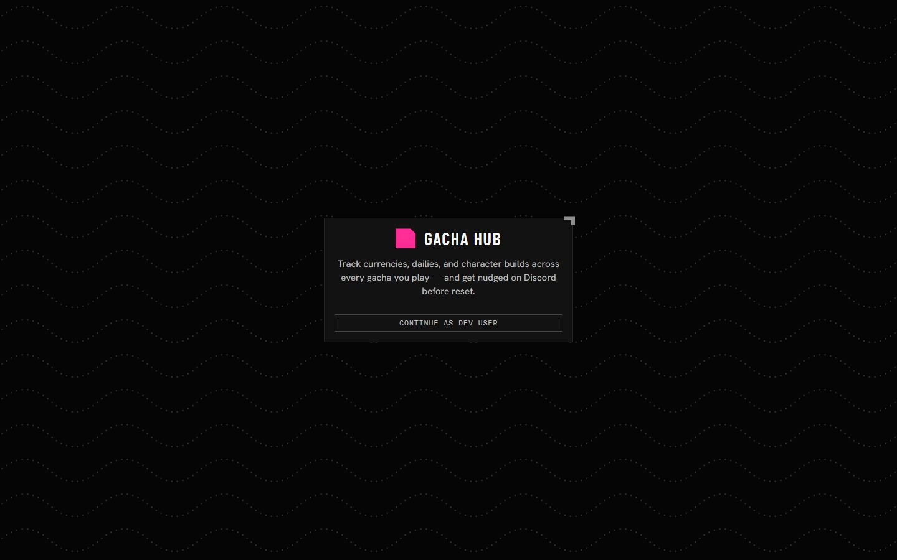

**For:** getting in. In production the button is "Sign in with Discord" (OAuth, whitelisted accounts only). Locally, "Continue as Dev User" appears when `DEV_LOGIN_ENABLED=true`. There is no sign-up.

### 8.2 Home

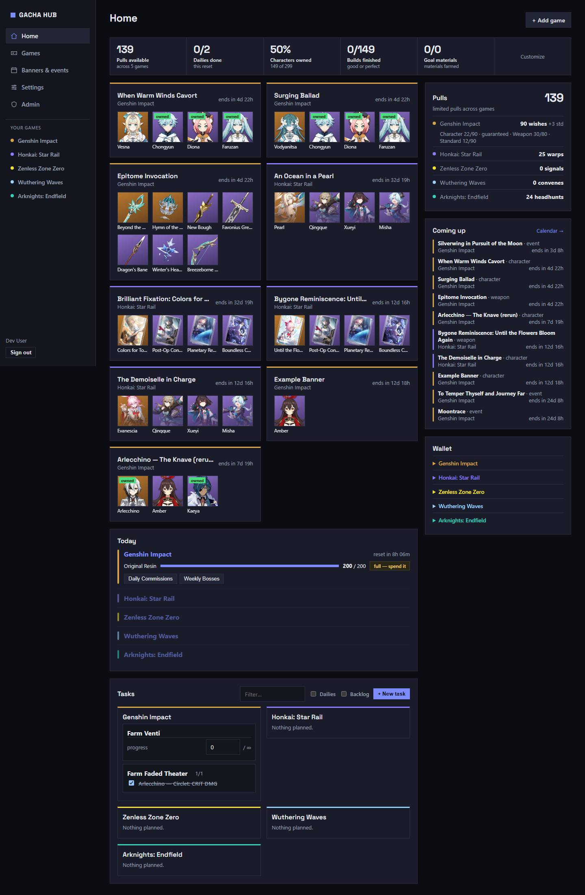

**For:** "what should I do today, across my games?" (WIREFRAMES.md H1; VISUAL-DESIGN.md §10). Scope it to one game with the top strip. It holds:
- **Daily and Weekly rings:** recurring items done this reset.
- **Goals:** a ring.
- **Goal types:** character, gear, weapons, gameplay.
- **Backlog:** a 10-day line.
- **Pull history:** premium currency gained and spent.
- **Dailies & weeklies:** one carousel card per game.
- **Battle pass:** level and time left.
- **The heat map:** dailies over the last 26 weeks.
- **Banners now:** a carousel with featured art and "owned" marks.
- **Pulls:** limited pulls per game, with each banner's pity.
- **Stamina:** "full at" times.
- **Endgame · next resets.**
- **Expiring soon.**

Data: `GET /api/dashboard` and `GET /api/tasks`.

### 8.3 Games (library)

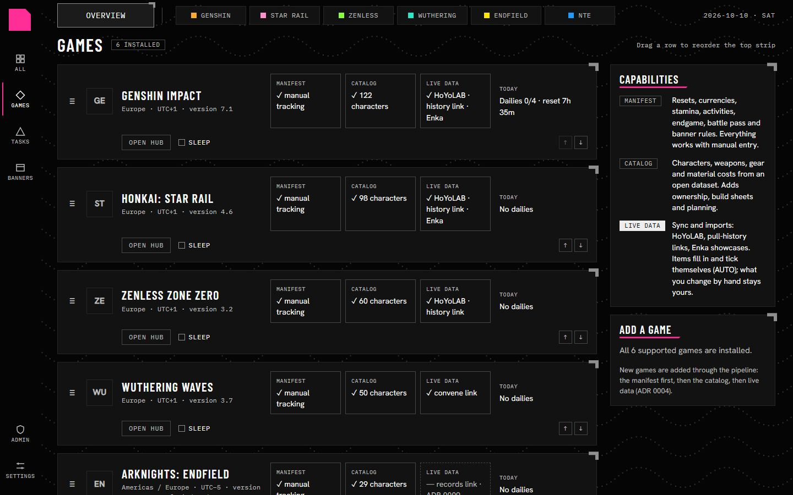

**For:** which games you track, and what each can do (A2). One row per installed game, in the top strip's order: drag a row, or use its arrows, to reorder. Each row holds:
- server, offset and version;
- the capability cells: Manifest, Catalog (its size, or why there is none), and Live data (HoYoLAB, history links, Enka, the convene or records link; or why there is none);
- today's dailies and the reset;
- Open hub, and Sleep. A sleeping game leaves Home and gets no reminders, without losing data.

The side panel explains the capabilities and lists games to add.

### 8.4 Tasks and reminders

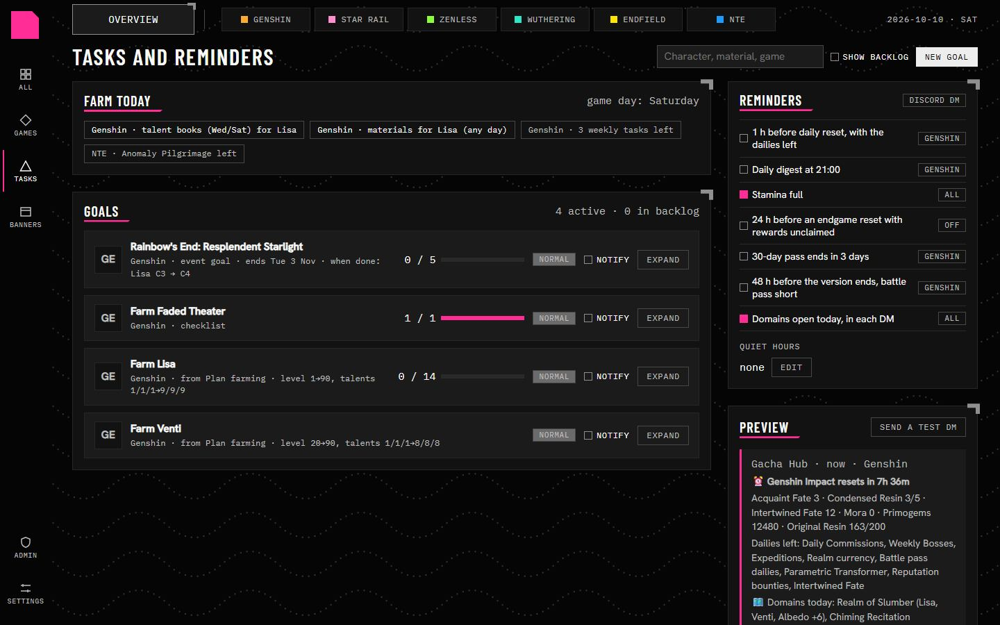

**For:** what to farm today, every goal, and the reminders (T1).
- **Farm today:** the game day, and what can be farmed in it (talent books on their weekdays, weekly tasks left).
- **Goals:**
  - from Plan farming, from an event reward (with its stages and what it gives when done), or by hand;
  - each with its progress, priority, Notify and Expand. Expand lists the steps, marked TODAY where farming is possible.
  - Show backlog adds the completionist goals generated on Profile.
- **Reminders:** the global rules (before reset, a daily digest, stamina full, endgame, passes, domains), quiet hours, and a preview of the DM with "Send a test DM".

### 8.5 Banners and events (calendar)

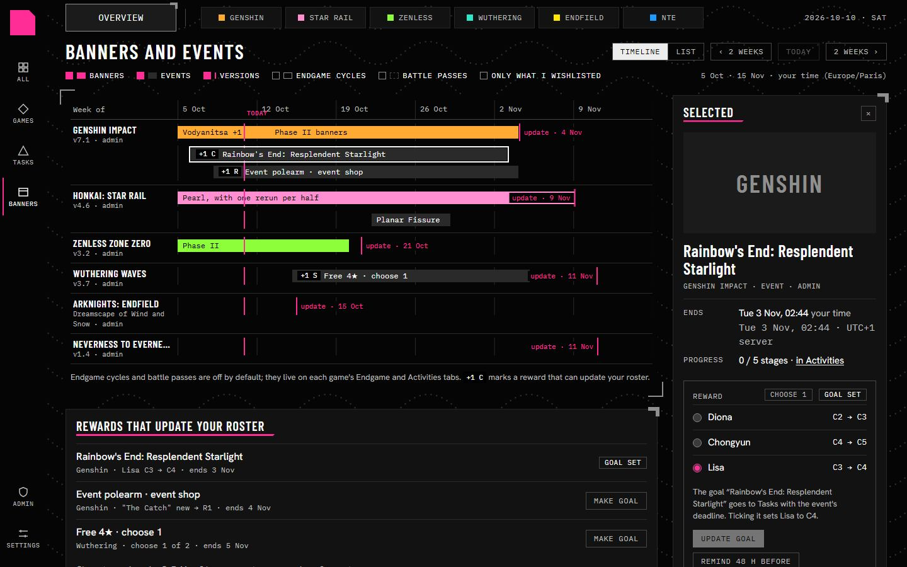

**For:** what runs and what ends soon, across games (C1). It is a timeline of weeks around today, a row per game:
- banners are solid bars and events lighter ones;
- the selected item opens beside it: art, dates, rewards and the goal they become;
- filters cover games, kinds, and "Only what I wishlisted";
- paging goes back into ended banners.

Genshin, Star Rail and ZZZ rows come from the hourly official feed; the others come from admin uploads.

### 8.6 Game hub · Activities

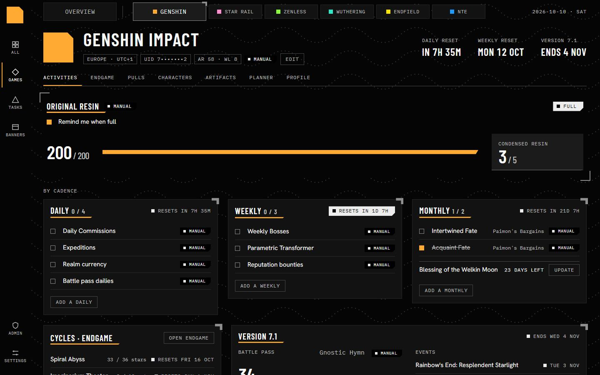

**For:** a game's day (G1). The hub's header, on every tab, shows:
- server and UID (masked);
- account and world level;
- daily and weekly resets;
- the version's end;
- the Edit button.

Activities holds:
- **stamina,** with its reserve and "remind me when full";
- **a card per cadence** (daily, weekly, monthly shops and passes), each with its reset countdown and items to tick or add;
- **this cycle's endgame** results;
- **the version:** battle pass and events.

### 8.7 Endgame

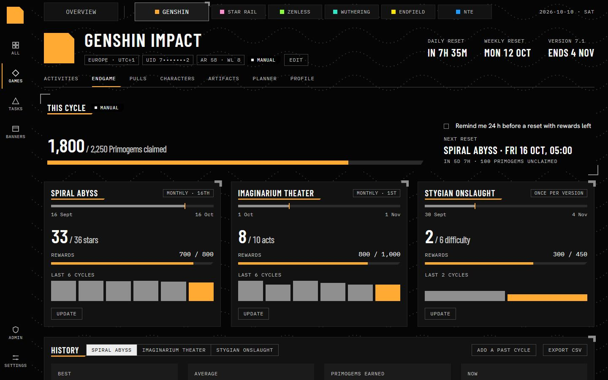

**For:** each endgame mode's cycle (G2): this cycle's result (stars, acts, difficulty…) and reward, the next reset, and the history of past cycles. Results come from the HoYoLAB chronicle when linked, or are typed in. Saved teams sit here too.

### 8.8 Pulls

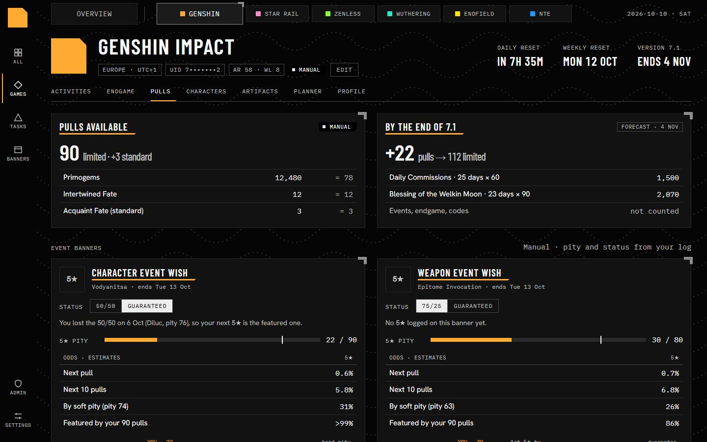

**For:** how close the next top pull is, and whether it will be the featured one (G3).
- **The top cards:**
  - "Pulls available" converts premium currency and tickets into pulls. Standard and weapon-only tickets are kept apart.
  - "By the end of the version" forecasts income.
- **One card per event banner:**
  - the 50/50 or guaranteed status;
  - pity against hard pity;
  - the odds (estimates);
  - the curve;
  - your chance with what you have;
  - the actions: +1, +10, Log a 5★ (6★ in Endfield), Set pity, Undo.
- **The savings planner** orders the featured targets, worst case or on average.
- **The history** lists every top pull with its pity.

Imports come from Settings.

### 8.9 Characters

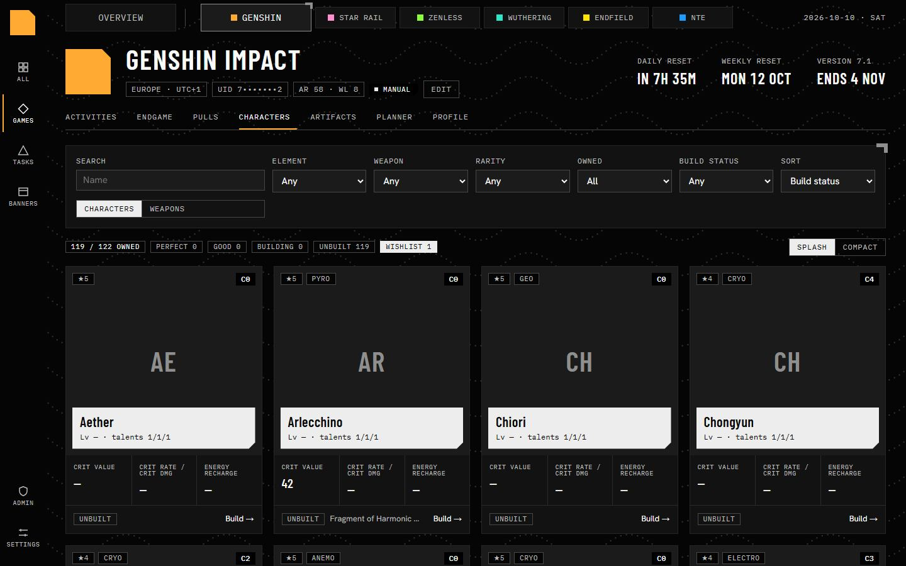

**For:** the roster (G4). The filters are element, weapon, rarity, owned, build status, and sort. Characters/Weapons switches between them, and Splash/Compact changes the view.
- **A splash card shows:**
  - rarity and element;
  - the dupe count (C, E, M, S or A in each game's words);
  - level and talents;
  - three KPIs chosen by the build's role;
  - build status, and Build → to the sheet.
- **Own** and **Wishlist** sit on unowned cards. The wishlist feeds the calendar filter and the savings planner.

### 8.10 Character sheet

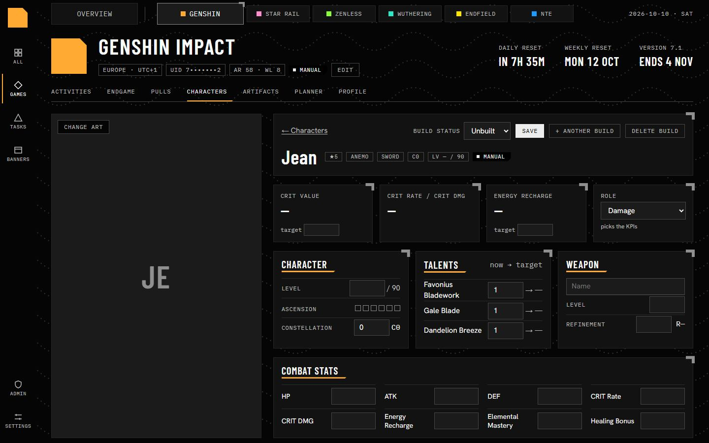

**For:** one build (G5).
- **Splash art**, which you can change with Change art.
- **The KPI tiles:**
  - each with its target: the build's own, or the game's default, marked "(default)";
  - the Role picker;
  - "Make these the game's defaults".
- **Character:** level, ascension, dupes.
- **Talents,** with their names, now → target.
- **Weapon,** picked from the catalog by type.
- **Combat stats.**
- **The gear block** in the game's shape:
  - 5 artifacts, 4 relics + 2 planar ornaments, 6 drive discs, 5 echoes under cost 12, 4 gear + an essence, the Console;
  - main stats per slot, crit value, and pieces flagged FARM.
- **Plan farming:** materials have and need, then the goal.
- **Used in:** the saved teams that hold the character.

Values from a sync are marked AUTO; what you change stays yours.

### 8.11 Gear (Artifacts, Relics, Drive discs, Echoes)

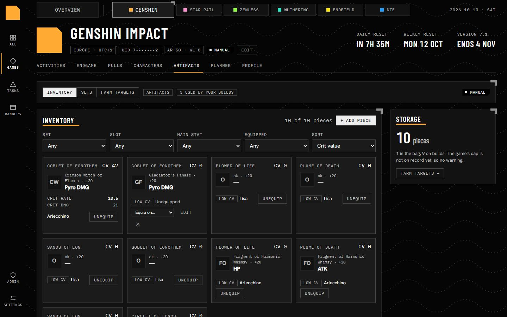

**For:** set pieces (G6).
- **Genshin** opens on the artifact inventory: pieces by crit value, add, equip, storage. It also has Sets, and a farming plan for a set and its main stats.
- **The other games** show their sets, which builds wear them, and Farm.

### 8.12 Planner

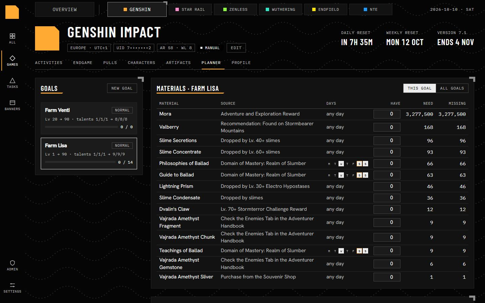

**For:** what to farm (G7):
- **Goals**, each with its steps;
- **Materials** for the goal or for all goals, with have, need and missing;
- **Farm today**, grouped by domain, where weekdays matter (Genshin).

Stock edits here are the source of truth for every goal's progress.

### 8.13 Profile

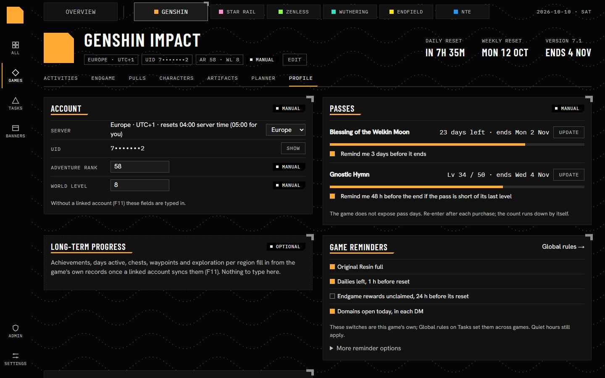

**For:** the account (G8).
- **Account:** server, UID, levels.
- **Wallet:** every currency.
- **Passes:** battle pass and 30-day pass.
- **Long-term progress.**
- **This game's reminders** and the finer reminder options.
- **Tools:** restore the default tasks; generate the completionist backlog.
- **Status.**

### 8.14 Settings

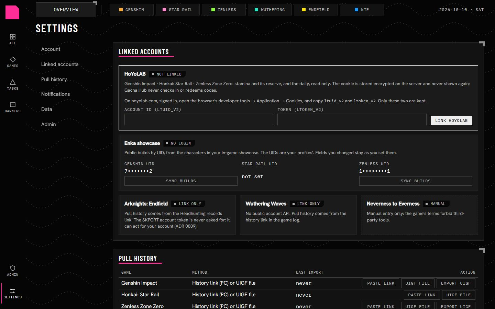

**For:** links, imports, notifications and your data (S1).
- **Linked accounts:**
  - HoYoLAB, read-only: notes every 30 minutes, the chronicle and roster on Sync now;
  - Enka showcases by UID for Genshin, Star Rail and ZZZ;
  - the Endfield, Wuthering Waves and NTE cards, which say what each allows.
- **Pull history:** a row per game:
  - paste the history, convene or records link (used once, never stored);
  - UIGF files in and out;
  - the last import.
- **Notifications:** Discord DMs, quiet hours, digest.
- **Account and data:** Download my data (every table you entered), and delete the account.

### 8.15 Admin

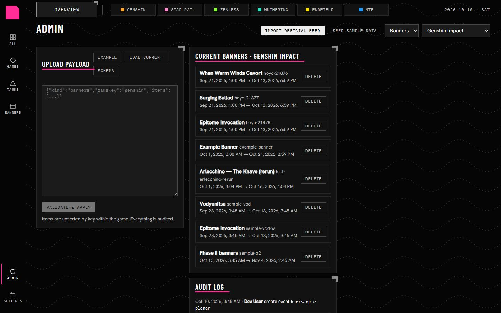

**For:** keeping banners and events correct, for admins only (`ADMIN_DISCORD_IDS`).

- **Import official feed** for the selected game (Genshin, HSR, ZZZ; also runs hourly from the cron).
- **Seed sample data** (two sample banners and events, to preview the UI; delete them in production once the feed runs).
- **Upload payload:**
  - paste JSON: banners or events (with their effects, ADR 0008), a game and the items;
  - **Example** fills a template, **Load current** loads what is live, and **Schema** shows the JSON schema;
  - **Validate & apply** upserts by key, with precise errors.
- **Current banners and events**, with Delete. Feed rows have `hoyo-…` keys.
- **Audit log:** every admin write, with actor, action and target.

### 8.16 Discord bot (no screen)

Slash commands arrive through HTTP interactions (`POST /api/discord/interactions`, signature-checked):
- `/status`;
- `/update` (a currency) and `/currency`;
- `/done` (tick a daily);
- `/own`, `/build` and `/goal`;
- `/farm`, the materials you still need that are farmable today;
- `/banner` and `/events`;
- Genshin's `/resin`.

Commands are registered with `npm run discord:register -w @gacha/server` once the bot variables are set.

## 9. Game-specific features

### Why every game has its own module

The games look alike from far away (a premium currency, a gacha, daily resets, characters with gear) and differ in every detail that matters for planning:

- **Builds have different shapes.** A Genshin character has 5 artifacts with fixed main-stat pools per slot and 3 talents; an HSR character has 6 relics split into cavern and planar sets plus traces; a WuWa character has echoes with a cost budget and sonata sets; Endfield attaches an essence to the weapon. One generic form would either lose these rules or turn into a form builder, which the owner ruled out.
- **Planning data differs.** Genshin talent books and weapon materials drop on fixed weekdays, which is what "Domains today" and the "domains open today" DM are for; HSR and WuWa materials are farmable every day, so the same screen would be noise there.
- **The gacha rules differ.** Hard pity is 90/80 in HoYoverse games but 80 for every WuWa banner; WuWa's weapon banner is always the featured weapon (100%), Genshin's and HSR's are 75%. The pull log's arithmetic is the same; its rules are per game.
- **Data sources differ.** Each catalog comes from a different open dataset with its own quirks (genshin-db, Project Yatta, a WuWa dataset, the Hakushin data for ZZZ, an Endfield dump with int64 ids). NTE's terms forbid third-party tools, so it is typed by hand.
- **Each game skins itself** (Genshin gold, HSR violet, ZZZ green, WuWa sky blue, Endfield yellow, NTE blue) and uses its own vocabulary (wish, warp, signal, convene, headhunt, roll; artifacts, relics, drive discs, echoes, gear, console cartridges).

So the host app stays generic over what all games share (profiles, currencies, resets, tasks, reminders, banners, pull log), and each game supplies a `GameDefinition` (`packages/shared/src/games/<key>`), a sheet (`apps/web/src/games/<key>/Sheet.tsx`) and optional server hooks (`apps/server/src/games/<key>.ts`).

### Feature matrix

| | Genshin | HSR | ZZZ | WuWa | Endfield | NTE |
| --- | --- | --- | --- | --- | --- | --- |
| Catalog (chars / weapons / sets / materials) | 122 / 255 / 63 / 536 (genshin-db) | 98 / 170 / 62 / 134 (Project Yatta) | 60 / 100 / 30 / 65 (Hakushin) | 50 / 112 / 29 / 128 (WutheringData) | 29 / 0 / 0 / 0 (EndFieldGameData) | none: typed by hand |
| Hub tabs besides Activities, Endgame, Pulls, Characters, Profile | Artifacts, Planner | Relics, Planner | Drive discs, Planner | Echoes, Planner | — (characters only, #175) | — |
| Character sheet | the shared sheet: catalog weapon picker, main stats per slot, sets, KPIs, splash art | same | same | same, with the echo cost cap | same, operator list | same, names typed; Console cartridges |
| Plan farming (levels, talents → tasks) | yes | yes | yes | yes | no costs in the dataset | — |
| Domains today, "domains open today" DM | yes | — | — | — | — | — |
| Pull log (hard pity, featured rate) | 90 50% · 80 75% · 90 | 90 50% · 80 75% · 90 | 90 50% · 80 75% · 90 | 80 50% · 80 100% · 80 | 80 50% (featured at 120) · 40 25% (featured at 80) · 80 | 90 100% |
| Pull history import | history link, UIGF | history link, UIGF | history link, UIGF | convene link | records link (ADR 0009) | — (by hand) |
| Live account data | HoYoLAB notes, chronicle, roster; Enka builds and talents | HoYoLAB notes, chronicle, roster; Enka builds | HoYoLAB notes, chronicle, roster; Enka builds | — | — (the account token can act for the account) | — |
| Official feed import | yes | yes (one banner per warp section) | yes (one banner per Signal Search) | — | — | — |
| Art (behind our R2 store once set up) | Enka | Yatta | Hakushin assets | Wuthery (characters, weapons) | initials | initials |
| Party size | 4 | 4 | 3 | 3 | 4 | 4 |
| Regions | NA (UTC−5), EU (UTC+1), Asia (UTC+8); reset 04:00 | same | same | same | Americas/Europe (UTC−5), Asia (UTC+8); reset 04:00 | Asia, America, Europe, SEA; reset 05:00, week on Monday |
| Default dailies | Daily Commissions; Weekly Bosses (weekly) | Daily Training; Assignments; Simulated Universe (weekly) | Daily Missions; Scratch Card | Daily Activity; Weekly Bosses (weekly) | Daily Tasks | Daily quests; Anomaly Pilgrimage (weekly) |
| Currencies | Original Resin (200, 7.5/h), Primogems (160/wish), Intertwined Fate, Acquaint Fate (standard), Mora | Trailblaze Power (300, 10/h), Stellar Jade (160/warp), Special Pass, Star Rail Pass (standard), Credits | Battery Charge (240), Polychrome (160/signal), Encrypted Master Tape, Master Tape (standard), Denny | Waveplate (240), Astrite (160/convene), Radiant Tide, Lustrous Tide (standard), Shell Credits | Sanity (360), Oroberyl (500/headhunt) | Character Pixels (240, 10/h), Annulith (160/roll), Solid Dice, Fabricated Dice (standard), Fons |
| Server hooks | `/resin`, resin projection on Home | — | — | — | — | — |

### Per game, and why

- **Genshin Impact** is the flagship and the reference implementation: the richest catalog, the only weekday-gated materials (hence Domains today and the domains DM), the only game with an artifact inventory and planner (artifact farming is the main long-term grind and the 5-slot main-stat rules are well defined), and official-feed import. New per-game work should copy its patterns.
- **Honkai: Star Rail** shares HoYoverse's gacha rules, announcement API, history link and HoYoLAB, so it gets the same imports and sync. Its feed notices bundle several warps per notice, so the parser splits them into one banner per section with its own dates. Its relic stat tables come from Enka's store so showcases can be read.
- **Zenless Zone Zero** got its catalog on 2026-10-10 from the Hakushin data (static.nanoka.cc, the dataset behind hakush.in, back under a new host): agents with promotions and five skill tables, W-Engines, Drive Disc sets and materials, so ownership, builds and planning work as for the other HoYoverse games. Its pulls come from the history link and UIGF, its live data from HoYoLAB.
- **Wuthering Waves** has a catalog with costs (so ownership, materials and planning work) and its own gacha rules (80 pity everywhere, 100% featured weapon). Echoes have a cost budget, which is why its sheet has a cost cap. Its pulls import from the convene link, and its art comes from Wuthery's copy of the game's textures.
- **Arknights: Endfield** has a character list only (the dataset has no upgrade costs), so ownership works and planning does not; its hub has no Gear or Planner tab. Its pulls import from the records link (ADR 0009). Its account data stays manual: only the SKPORT account token reaches it, and that token can act for the account.
- **Neverness to Everness** (Perfect World) is tracked by hand only (capability M, ADR 0004): its terms forbid third-party tools, so there are no imports, no catalog and no art. The manifest still gives it everything shared: resets at 05:00 on four servers, currencies and stamina, the Limited Board's pity (90, no 50/50), Beyond the Rails, the battle pass and monthly pass, and the shared sheet with its Console cartridges.

## 10. Cross-cutting features

- **Tasks and goals.** Three kinds: recurring dailies/weeklies (reset with the game day), goal tasks ("Farm X", with derived progress), and checklists (artifact pieces). Priority, backlog, notify flag. Board on Home, To-do on the game page.
- **Generate backlog.** A "Farm X (max)" goal tree per owned character, kept apart from manual plans (matched by origin and the backlog flag), for completionists.
- **Builds.** Several named builds per character; status Unbuilt, Building, Good or Perfect feeds the "builds finished" KPI. Build documents are versioned and migrated lazily on read.
- **Teams.** Saved party presets per game, sized by the game's party size.
- **Reminders.** Before-reset and at-time rules per game profile; idempotent per `(rule, firedFor)`; DM content options.
- **Export.** `GET /api/export`, round-trips every user-owned table.
- **Limits.** Every number has a hard limit (`LIMITS`), enforced by the zod DTOs.
- **Art.** Our own copy first (`VITE_ASSET_BASE`: the R2 bucket the `mirror-art` workflow fills, ADR 0006; unset until Georges creates it), then the community fallback (`communityArtUrl` in `packages/shared/src/art.ts`: Enka for Genshin, Yatta for HSR), then initials. Source-internal paths (WuWa Unreal paths) are skipped instead of requested.
- **Security.** Discord-only auth, signed session cookie, admin routes rate-limited and audited, cron endpoint behind `CRON_SECRET`, CSP and hardening headers, RLS on every table.

## 11. API map

All under `/api`, JSON, session cookie. Inputs and outputs are zod DTOs from `packages/shared/src/dto`.

| Resource | Routes |
| --- | --- |
| Auth | `GET /auth/discord`, `GET /auth/discord/callback`, `POST /auth/dev-login`, `POST /auth/logout`, `GET /me` |
| Games | `GET /games`, `GET /games/:key/banners?status=active\|ended\|all`, `GET /games/:key/events` |
| Profiles | `GET/POST /instances`, `GET/PUT/DELETE /instances/:id` (region, sleeping), `PUT /instances/:id/currencies/:key`, `POST /instances/:id/tasks/defaults`, `POST /instances/:id/backlog/generate`, `GET/PUT/DELETE /instances/:id/reminder` |
| Ownership | `GET/PUT /instances/:id/ownership` |
| Builds | `GET/POST /instances/:id/characters`, `GET/PUT/DELETE /characters/:id`, `POST /characters/:id/unequip` |
| Gear | `GET/POST /instances/:id/gear`, `PUT/DELETE /gear/:id`, `POST /gear/:id/equip` |
| Materials and planning | `GET/PUT /instances/:id/materials`, `GET /instances/:id/materials/needed`, `POST /instances/:id/plans/preview`, `POST /instances/:id/plans/generate` |
| Tasks | `GET/POST /tasks`, `PUT/DELETE /tasks/:id`, `POST /tasks/:id/complete` (an event goal applies or reverses its effects), `POST /tasks/:id/progress`, `PUT /tasks/:id/checklist`, `POST /events/:id/goal` (make or re-pick an event goal, ADR 0008), `GET /rewards` (open roster rewards with each option's step and the goal), `GET /farm-today` (per profile: materials open on its game day for each farming goal, weeklies left), `GET /reminders/preview` (the DM each game would send now), `POST /reminders/test` (send it to yourself) |
| Teams | `GET/POST /instances/:id/teams`, `PUT/DELETE /instances/:id/teams/:teamId` |
| Pulls | `GET/POST /instances/:id/pulls`, `DELETE /instances/:id/pulls/:entryId`, `POST /instances/:id/pulls/calibrate`, `POST/GET /instances/:id/pulls/uigf` (UIGF v4.2 import, `?uid=` to pick an account; export), `POST /instances/:id/pulls/history-link` (`{url, next?}`: pages the official log, returns `next` to call again with) |
| Linked accounts | `GET /links` (never the secret), `DELETE /links/:id` (revoke), `POST /links/hoyolab` (`{ltuid, ltoken}`: checked with HoYoLAB, sealed, fills the profiles it plays; 503 without `LINK_SECRET_KEY`), `POST /links/:id/sync` (real-time notes now; the cron does it every 30 minutes) |
| Account | `GET /imports` (latest imports and syncs), `DELETE /me` (`{confirm: username}`) |
| Showcase | `POST /instances/:id/enka` (Genshin builds from the Enka showcase by the profile's UID) |
| Home, calendar, export | `GET /dashboard`, `GET /timeline?from&to`, `GET /export` |
| Admin | `POST /admin/payload`, `GET /admin/payload/schema`, `GET /admin/export`, `DELETE /admin/:kind/:gameKey/:key`, `POST /admin/feed/:gameKey`, `GET /admin/audit` |
| Platform | `POST /cron/tick` (x-cron-secret), `POST /discord/interactions` (signed), `POST /uploads` (Blob) |

Handlers are in `apps/server/src/api/*.ts`; the integration tests next to them show each route in use.

## 12. Process and quality gates

The workflow is the portfolio standard (`docs/ENGINEERING.md`, synced from portfolio-infra) plus `AGENTS.md`:

- **Test first.** Failing test, commit `test(<area>): …`, then `feat|fix(<area>): …`. Never weaken a test.
- **Small stacked PRs** (about 400 changed lines), branches `stack/<topic>/<nn>-<slug>`, Conventional Commits, PR template, drafts until CI is green; the owner merges.
- **Always `gh pr create --head <branch>`** and check the diff size (#57 once squashed twelve PRs into one because a rebase left the wrong branch checked out). Retarget the next PR to `main` *before* deleting a merged base branch (deleting first closed #41 for good).
- **Check all:** `npm run check` = generate Prisma client → lint → typecheck → tests → build → budget → E2E. Stop the dev server first on Windows (it locks the Prisma engine DLL).
- **CI** (`ci.yml`): `lint`, `typecheck`, `test`, `build` (+ budget once #78 merges), `e2e`; all required.
- **Tests:** Vitest unit, fast-check properties (game day across regions and reset hours; pity), route integration tests over a throwaway SQLite database, bundle harnesses (`npm run harness`), Playwright journeys (`e2e/`: sign-in lands on Home, adding Genshin shows today's domains, the calendar, pulls, export, no CSP violations; the axe journey joins when the a11y branch lands). Journeys share one database, so newer ones use HSR to stay independent.
- **Budget:** initial JS at most 200 KB gzipped (149 KB on 2026-10-06), `npm run budget`.
- **Vercel previews** are off for `stack/**` and `dependabot/**` (Hobby allows 100 deployments a day; restacking burned through it once).
- **PR memes:** the owner's portfolio workflow (`pr-meme.yml`, from #80) and the agent's own `pr-meme` skill add a meme on open and before merge or close.
- **Logs:** an `docs/AGENT_LOG.md` entry per PR; `HANDOFF.md` rewritten every session; ADRs for scope changes.

## 13. Work state

As of 2026-10-08, `main` at `36edfc0` (docs(agents): read and rewrite HANDOFF.md every session, #83), deployed, smoke green.

**Merged history, by milestone:** phases 1–9 (#1–#9: foundation, catalogs, ownership, planning, banners/admin, integration tests, deploy runbook); product iterations #14–#39 (tasks board, builds, teams, artifacts sets/inventory/planner, reminders at chosen times, Home rebuild, design pass, sleep); process P (#42–#44); F1 feed + calendar (#40, #49); F2–F4 (domains core, farm-today DM, HSR feed); F5 pull log (#60, #62); P2 smoke (#66); F6 export (#67); F7 calendar history (#68); hardening and upgrades (#63–#77: art fix, Dependabot groups, Fastify plugins, harness DB, node-cron 4, Vitest 5, Vite 8, React 19, React Router 7, CSP, zod 4); #80 PR memes; #81–#83 standards sync and the handoff procedure.

**Open PRs** (both draft, CI green, waiting for the owner):

| PR | Branch | What |
| --- | --- | --- |
| #78 | `stack/perf/01-budget` | CI fails when initial JS passes 200 KB gzipped |
| #79 | `stack/ops/03-prisma7-prep` (on #78) | Prisma-7-ready scripts (absolute SQLite URLs, no `--accept-data-loss`), Prisma 7 spike recorded in ADR 0003 |

**Branches with unmerged work:**

- `stack/a11y/01-axe` (on #79): `49c113c` an axe E2E test (no serious violations on the main pages), `b2066a6` WIP accessible names (a `FieldLabel` context with `aria-labelledby` in `components/inputs.tsx`). Not a PR yet; the test still fails (§14.2).
- `spike/prisma7`: the Prisma 7 experiment. Never merge; ADR 0003 holds the findings.
- Many old `feat/*`, `fix/*`, `ui/*` remote branches belong to merged PRs and can be deleted.

## 14. To do

Every milestone in DESIGN.md §9 is built, V through F12. What is left waits on the owner, on a data source, or is optional. `HANDOFF.md` holds the current state.

### 14.1 Needs the owner (an agent cannot do these)

1. **Turn on the cron:**
   1. Create one random secret.
   2. Set it as `CRON_SECRET` in Vercel (Production) and as the GitHub Actions secret `CRON_SECRET`. `CRON_URL` is already set.
   3. Redeploy.

   The next tick then runs reminders, the HoYoLAB sync and, hourly, the official feed import.
2. **Turn on DMs** (`docs/DEPLOY.md` has the steps):
   1. Set `DISCORD_BOT_TOKEN` in Vercel, and check `DISCORD_APP_ID` and `DISCORD_PUBLIC_KEY`.
   2. Invite the bot to a server you share with the users. A bot can only DM people it shares a server with.
   3. Register the slash commands: `npm run discord:register -w @gacha/server`, with the bot variables set.
   4. Set the Interactions Endpoint URL to `https://gacha-hub-two.vercel.app/api/discord/interactions`.
3. **Turn on linking:** set `LINK_SECRET_KEY` in Vercel (32 random bytes, base64). Until then, linking answers "off" (ADR 0005).
4. **Turn on the art store** (`docs/DEPLOY.md` §7):
   1. Create the R2 bucket with public `r2.dev` access, and an API token.
   2. Add `R2_ACCOUNT_ID`, `R2_ACCESS_KEY_ID`, `R2_SECRET_ACCESS_KEY` and `R2_BUCKET` as Actions secrets.
   3. Run the **mirror-art** workflow.
   4. Set `VITE_ASSET_BASE` in Vercel and redeploy.

   F12's acceptance ("every game shows art from our store") is checked after this.
5. **Clean production banners and events:** in Admin, delete the `sample-*` rows for each game. Then import the official feed, or wait for the hourly tick after step 1.
6. **Branch ruleset on `main`:** require the checks `lint`, `typecheck`, `test`, `build` and `e2e`.
7. **Decisions:** taken by the agent on 2026-10-10 at Georges's request: ADR 0009 accepted; Enka's store and the Hakushin data used with credit in NOTICE and removed on request; the items in §14.2 decided against, each with its reason. Overrule any of them by saying so.
8. **Real data, to replace what the agent built from documentation.** Save each answer as JSON from the browser's network tab, with tokens, cookies and account ids removed:
   - **Endfield:** one page of `ef-webview.gryphline.com/api/record/char` and one of `/api/record/weapon`. The records import (#179) was built from open-source parsers.
   - **ZZZ:** your UID. Enka showcases are public, so the agent fetches the real answer itself; the reader (#183) was built from Enka's documentation.
   - **HoYoLAB,** for each of Genshin, Star Rail and ZZZ you play:
     - the record card (`getGameRecordCard`);
     - the real-time notes;
     - each chronicle mode, especially ZZZ's `hadal_info_v2`, so Shiyu Defense's newer layout can be read;
     - the character list.
   - **History links:** one `getGachaLog` page for Genshin, Star Rail or ZZZ, and one WuWa convene answer (`gacha/record/query`).
   - **In-game details pages,** for values no wiki states (`docs/games/*.md`, marked `~`): ZZZ's W-Engine rates, Endfield's Arsenal odds, Star Rail's and NTE's battle pass weekly caps, WuWa's Coral Shop reset.
9. **README:** record the demo GIF (DESIGN.md §15); set the repository description and topics.
10. **Delete stale remote branches** of merged PRs. The agent's delete was blocked by its permission rules:
    - `stack/docs-v2/01-design-adrs` to `06-design-files`;
    - `stack/docs/01-guide`, `stack/f11/15-enka-hsr` and `stack/fix/01-auth-hooks`;
    - `stack/infra/01-pr-meme`, `stack/ops/03-prisma7-prep` and `stack/perf/01-budget`.
11. **Verify after the cron is on:** a reminder DM arrives (DESIGN.md §15's last open item), and the calendar shows `hoyo-` rows in production.

### 14.2 Agent work

**Waiting on data**

1. **Real answers to replace the fixtures**, from Georges with the tokens removed (§14.1 step 8): Endfield's records (#179) and ZZZ's Enka showcase (#183) were built from the shape their documentation and open-source parsers give.
2. **TypeScript 7** (ADR 0003): 7.0.2 is out, but typescript-eslint supports TypeScript below 6.1 (checked 2026-10-10).

**Decided against, with the reason (2026-10-10, at Georges's request to take every decision)**

- **Endfield art:** its wiki serves images by name, but it answered HTTP 429 after a short burst. It can neither serve as a hotlinked fallback nor feed the mirror reliably. No other host exists.
- **WuWa material and Sonata set art:** no screen shows material icons (WIREFRAMES.md), and the Sonata "icons" are the same element icon for every set.
- **Shiyu Defense's newer layout (v2) in the chronicle:** it rates floors 4 and 5 by score, unlike the manifest's "S-rank frontiers". Without a recorded answer, the mapping would be a guess. The first layout is read.
- **Endgame eligibility in Used in:** no source publishes each cycle's rules in a structured form. Typing them in every cycle goes against the pipeline rule.
- **The Genshin constellation reference card:** the redesigned sheet has no slot for it (WIREFRAMES.md).

**Done since the list was first written:**
- accessibility (V);
- error states (#174);
- the docs drift (#176);
- catalog-backed sheets for every game (F10);
- Endfield's tabs (#175);
- art for WuWa (#172) and ZZZ (#182);
- HSR trace markup (#173);
- Prisma 7 (D);
- the art mirror (F12);
- Endfield pull history (#177–#180);
- a ZZZ catalog (#181);
- Enka for ZZZ (#183);
- talent names (#184);
- Genshin talents from Enka (#185);
- Stygian Onslaught (#186);
- default KPI targets (#187).

**Later (DESIGN.md §4):** a per-game overview that shows each game's own resources (NTE's Fons, not Genshin's resin), public showcase pages, PWA, and i18n through the datasets' text maps.

**Long-term progress** (Georges, 2026-10-10): chests, waypoints, exploration and events are not synced. They are goals typed by hand, one type ("gameplay" on Home), listed and added on Profile.

## 15. Known issues

| Issue | Where | Fix |
| --- | --- | --- |
| Reminders and the feed import never run in production | GitHub secret `CRON_SECRET` empty | §14.1 step 1 |
| Linking answers "off" in production | `LINK_SECRET_KEY` unset | §14.1 step 3 |
| Art is hotlinked from community CDNs | `VITE_ASSET_BASE` unset | §14.1 step 4 |
| Production calendar shows only sample banners | Prod data | §14.1 step 5 |
| Rate limiter is in memory per serverless instance | `@fastify/rate-limit` | Best effort; accepted |
| Feed times are inconsistent upstream | HoYoverse API | `settle()` handles it; admins can edit rows |
| Old design docs predate DESIGN.md | `docs/DESIGN-BRIEF.md`, `docs/DESIGN-HANDOFF.md` | DESIGN.md and VISUAL-DESIGN.md win |

## 16. Gotchas

**Semantics that must not break**

- Inventory is the source of truth: a "Farm X" task stores the raw total; progress is derived from `MaterialStock` (capped at target). Never subtract stock twice.
- Task generation is idempotent: `origin.sources[]` holds one entry per goal `{kind, catalogId, goal, qty}`; re-planning replaces it; target = Σ qty.
- Level ranges are **caps** (20 → 90) because cost tables are keyed by the cap a step unlocks; talent ranges are plain levels.
- Build documents carry `docVersion`; per-game `migrations[n]` run lazily on read and persist.
- "Farmable today" uses the **game day** (region weekday shifted by the reset hour), not the calendar weekday.
- Reminders are idempotent per `ReminderLog (ruleId, firedFor)`.
- Admin payloads round-trip: export returns exactly what upload accepts; upsert key `(gameKey, key)`; every write audited. Feed rows (`hoyo-…`) never overwrite admin rows.

**Production**

- Never set `NODE_ENV` on Vercel (`npm ci` would drop dev dependencies and the build fails). Production safety comes from `DEV_LOGIN_ENABLED=false` and `COOKIE_SECURE=true`.
- The Vercel framework preset must stay **Other** (null); otherwise Vercel detects the Dockerfile and ignores `vercel.json`.
- The function entry is `api/index.mjs` (ESM). A `.ts` entry compiles to CJS and fails with `ERR_REQUIRE_ESM`; `.mts` is not recognized as a function.
- Every new table needs `ENABLE ROW LEVEL SECURITY` in its migration.
- Migrations are written offline with `prisma migrate diff` and applied in the Vercel build; there is no local Postgres.
- Secrets are entered by the owner only; sensitive Vercel variables cannot be renamed, only re-created.

**Local and tooling**

- `npm test` regenerates the Prisma client for SQLite; `npm run check` regenerates the Postgres client before the build, then E2E switches back. Stop the dev server first: the generated client is provider-specific.
- SQLite URLs must be absolute (Prisma's CLI and client resolve relative paths differently).
- Fastify rejects an empty body sent with `content-type: application/json`.
- `eslint-plugin-react-hooks` 7: no `setState` in effects (use keyed components), no components created during render.
- `cmd | tail` swallows exit codes; use `set -o pipefail` and `&&`.
- `git` prints LF→CRLF warnings on Windows; benign.
- Owner files in the working tree (`gacha-wireframes/`, `index.html`, `pull-log-gacha-tracker.html*`, `design-canvas/`, `.claude/`) stay uncommitted.

**Catalogs** (`scripts/catalog`, isolated install: `npm run catalog:install`)

- `genshin-db` contains dummy characters with null costs; the importer skips invalid cost rows. Duplicate display names get id-suffixed keys: look things up by `id`.
- Yatta (HSR) returns `{id, name}` objects for type fields, normalized by `label()`.
- The Endfield dataset has int64 ids (`parseInt64Safe` pre-pass) and a zip Windows `tar` cannot open (`adm-zip`).
- Dead ends, do not retry: Dimbreath/StarRailData (HTTP 451), hakush.in's old API hosts (NXDOMAIN; its data now lives on static.nanoka.cc), HoYoWiki API (403), Enka data (unlicensed), zzz-data (too thin), ZenlessAssetScrape (GPL, icons only).

**Official feed**

- Genshin uses `getAnnList` type 1 notices; HSR splits `pic_list` sections titled `During "<warp>" Character|Light Cone Event Warp`; ZZZ (host `sg-announcement-api.hoyoverse.com`) splits its `pic_list` "Limited-Time Channels" notice at each `"<channel>" Signal Search Details`, up to the `※` notes.
- The API answers in Asia, Europe or America clock time, all labelled UTC+1; `settle()` recovers Europe from two observations 6, 7 or 13 hours apart.

## 17. Reference: docs, ADRs, glossary

**Docs:** `HANDOFF.md` (current state, short) · `docs/DESIGN.md` (spec) · `docs/ENGINEERING.md` (workflow) · `AGENTS.md` (agent manual and commands) · `docs/AGENT_LOG.md` (history) · `docs/DEPLOY.md` (deploy runbook) · `docs/adr/` · `README.md`.

**ADRs** (0001–0007 accepted on 2026-10-09, 0008 on 2026-10-10; 0004–0008 are listed in `docs/adr/`): 0001 where this repository departs from the portfolio standard (npm workspaces, ESLint + Prettier, own Supabase project, `dub1`, deploy mode A, HTTP-only production smoke, Dependabot majors by hand, the pr-meme row now stale) · 0002 pull log entries and pity · 0003 remaining major upgrades and the Prisma 7 spike.

**Glossary**

| Term | Meaning |
| --- | --- |
| Pull / wish / warp / signal / convene / headhunt | One gacha roll, in each game's word |
| Pity | Rolls since the last 5★; hard pity guarantees a 5★ at that count |
| 50/50, guarantee | A 5★ on a featured banner is the featured unit with that chance; after losing it, the next 5★ is guaranteed featured |
| Banner | A limited-time gacha with featured units |
| Event | A limited-time in-game activity with rewards |
| Dailies | Tasks that reset at the daily server reset (04:00 region time) |
| Game day | The weekday as the game sees it: region time shifted back by the reset hour |
| Domain | Genshin dungeon dropping talent or weapon materials on fixed weekdays |
| Artifact / relic / drive disc / echo / gear | Each game's equippable set pieces |
| Build | A recorded configuration of one character (gear, levels, talents) |
| Profile / instance | One user's data for one game (`GameInstance`) |
| Catalog | The imported game data: characters, weapons, sets, materials, costs |
