# gacha-hub: project guide

> Written 2026-10-08 (claude) against `main` at `36edfc0`. A full picture of the project for whoever picks it up next: what it is for, every screen, why each game has its own features, how the pieces fit, and everything left to do.
>
> **How it relates to the other docs.** `HANDOFF.md` (repository root, about 60 lines) is the short session-to-session state and is rewritten every session. `docs/DESIGN.md` is the specification and wins on scope. `docs/AGENT_LOG.md` is the history, one entry per PR. This guide is the long version: refresh its "Work state" (§13) and "To do" (§14) sections when they drift, and the screenshots when a screen changes.

## Contents

1. [TL;DR](#1-tldr)
2. [What it is: purpose, goals, scope](#2-what-it-is-purpose-goals-scope)
3. [Live system and environments](#3-live-system-and-environments)
4. [Architecture](#4-architecture)
5. [Data model](#5-data-model)
6. [Key flows](#6-key-flows)
7. [Screen map](#7-screen-map)
8. [Screen by screen](#8-screen-by-screen)
9. [Game-specific features](#9-game-specific-features)
10. [Cross-cutting features](#10-cross-cutting-features)
11. [API map](#11-api-map)
12. [Process and quality gates](#12-process-and-quality-gates)
13. [Work state](#13-work-state)
14. [To do](#14-to-do)
15. [Known issues](#15-known-issues)
16. [Gotchas](#16-gotchas)
17. [Reference: docs, ADRs, glossary](#17-reference-docs-adrs-glossary)

---

## 1. TL;DR

- **What:** a tracker for people who play several gacha games at once (Genshin Impact, Honkai: Star Rail, Zenless Zone Zero, Wuthering Waves, Arknights: Endfield, Neverness to Everness). It answers "what should I do in my games today?": pulls I can afford, dailies left before reset, which characters I own and how far their builds are, what to farm today, which banners and events are running. Discord sign-in and Discord DM reminders.
- **Who:** a handful of whitelisted friends plus a public demo. Code is public: `adam-riffi/gacha-hub`. Owner: Georges.
- **Where:** live at https://gacha-hub-two.vercel.app (Vercel Hobby + Supabase Postgres eu-west-1 + GitHub Actions as the cron).
- **State:** every milestone in `docs/DESIGN.md` §9 is built, V through F12. CI, the production smoke check and the security headers are in place.
- **What blocks "done":** secrets only the owner can set: `CRON_SECRET` (reminders, the feed import and the HoYoLAB sync), `LINK_SECRET_KEY` (linking), the R2 bucket (our art store) and the Discord bot (§14.1).
- **Next agent work:** §14.2.

## 2. What it is: purpose, goals, scope

### The problem

Someone playing four or five gacha games juggles separate daily resets, separate premium currencies, separate pity counters, and separate "which domain is open today" calendars. Each game's own UI only knows about itself, and the planning information (how many materials a level-90 character needs, which weekday a talent book drops) lives in wikis. gacha-hub puts all of it in one place and reduces data entry to picking from catalogs and ticking boxes.

### Goals (DESIGN.md §2)

- Answer "what should I do in my games today?" in one screen (**Home**) and per game (the **game page**).
- Fast data entry: pick from a catalog, toggle, tick; almost never type.
- Free to run: Vercel Hobby, Supabase Free, GitHub Actions cron. No always-on process, no queue.
- Game data is accurate because it is imported from open datasets, never hand-typed.

### Non-goals

- A generic "build your own game" tracker. Every game is hardcoded (locked decision).
- Account sync through HoYoLAB, Enka or game logins (deferred; needs an owner decision and an ADR).
- Mobile layout and stamina (resin) tracking: dropped by the owner on 2026-10-04. The resin bar on Home and the `/resin` bot command predate that and stay as they are; do not extend them.
- Monetization, public sign-up.

### Locked product decisions (do not relitigate)

Every game is a bespoke module and sheet · Discord-only sign-in, admins listed in `ADMIN_DISCORD_IDS` · one profile per user per game, region defaults to EU · free hosting only · catalog data comes from the importer pipeline, never typed by hand · hard limits on every number (`LIMITS` in `packages/shared/src/common.ts`).

### Shipped scope (v1)

| Area | What ships |
| --- | --- |
| Games | Genshin, HSR, WuWa (catalog, builds, planner); Endfield (catalog for ownership only); ZZZ (currencies, dailies and pulls; no catalog); NTE (by hand only: its terms forbid third-party tools) |
| Profiles | One per game, region-aware resets, currencies and pull counts, "put to sleep" |
| Roster | Ownership grid; catalog-backed builds with a bespoke sheet per game; several named builds per character |
| Gear | Genshin artifacts: set browser, inventory bag with equip/unequip, farming planner. Other games: set browser |
| Planning | Material requirements from catalog costs, goal tasks with material subtasks, inventory as source of truth |
| Home | KPI strip, banners now, Today, task board, pulls with pity, coming up, wallet |
| Banners and events | Admin JSON uploads with audit log; Genshin and HSR official-feed import; calendar with paging back into history |
| Discord | OAuth sign-in, 10 slash commands, DM reminders before reset and at chosen times, optional "domains open today" line |
| Pull log | Per banner type with pity and the 50/50 guarantee (ADR 0002) |
| Export | Everything a user entered as one JSON file |

## 3. Live system and environments

| Thing | Value |
| --- | --- |
| Production URL | https://gacha-hub-two.vercel.app (auto-deploys `main`) |
| Repository | https://github.com/adam-riffi/gacha-hub (public) |
| Vercel | team `Wuxinggraph` (`team_TQggk8RvXbuHw2YtnZ4kbouw`), project `gacha-hub` (`prj_mKfaViC5ARkgBz2TRjyk1xRRz6tN`), framework preset **Other**, functions in `dub1`, Blob store `gacha-hub-uploads` |
| Supabase | project `gacha-hub`, ref `fmacvvwhvnhyncpkaimi`, eu-west-1; pooler host `aws-0-eu-west-1`; RLS on every table, no policies |
| Migrations | 9, applied by `prisma migrate deploy` inside the Vercel build |
| Cron | `.github/workflows/cron-tick.yml` every 10 minutes → `POST /api/cron/tick` |
| Smoke | `.github/workflows/smoke.yml` after each production deployment (last: success on `36edfc0`, 2026-10-07) |

**Environment variables** (owner enters them; `.env.example` lists them; never set `NODE_ENV` on Vercel):

| Variable | Purpose | Production status (2026-10-08) |
| --- | --- | --- |
| `DATABASE_URL`, `DIRECT_DATABASE_URL` | pooled and direct Postgres | set |
| `SESSION_SECRET`, `COOKIE_SECURE=true`, `APP_BASE_URL` | sessions | set |
| `DISCORD_CLIENT_ID`, `DISCORD_CLIENT_SECRET`, `DISCORD_OAUTH_REDIRECT` | web sign-in | set (`/api/me` reports `oauth: true`) |
| `DISCORD_APP_ID`, `DISCORD_PUBLIC_KEY` | bot interactions | check |
| `DISCORD_BOT_TOKEN` | sending DMs, registering commands | **not set** |
| `ADMIN_DISCORD_IDS` | who sees Admin | set |
| `CRON_SECRET` (Vercel) | guards `/api/cron/tick` | unknown: set it together with the GitHub one |
| `BLOB_READ_WRITE_TOKEN` | image uploads | injected by the Blob store |
| `DEV_LOGIN_ENABLED=false` | dev shortcut off | set (`devLogin: false`) |
| GitHub secrets `CRON_URL`, `CRON_SECRET` | the tick workflow | `CRON_URL` set, **`CRON_SECRET` empty**: every tick logs "secrets not set; skipping" |

**Production data** (checked during the 2026-10-07 audit): Banner and Event tables hold only the "Seed sample data" rows (2 per game, from 2026-10-04) and no `hoyo-` feed rows; `PullEntry` exists and is empty.

**Local:** `npm ci`, `npm run db:sqlite`, `npm run dev` (web :5173, API :3000), then "Continue as Dev User". Add `ADMIN_DISCORD_IDS=dev-local-user` to `.env` to see Admin. Local and test databases are SQLite; Docker's Linux engine does not start on the owner's machine, so Postgres is never run locally.

## 4. Architecture

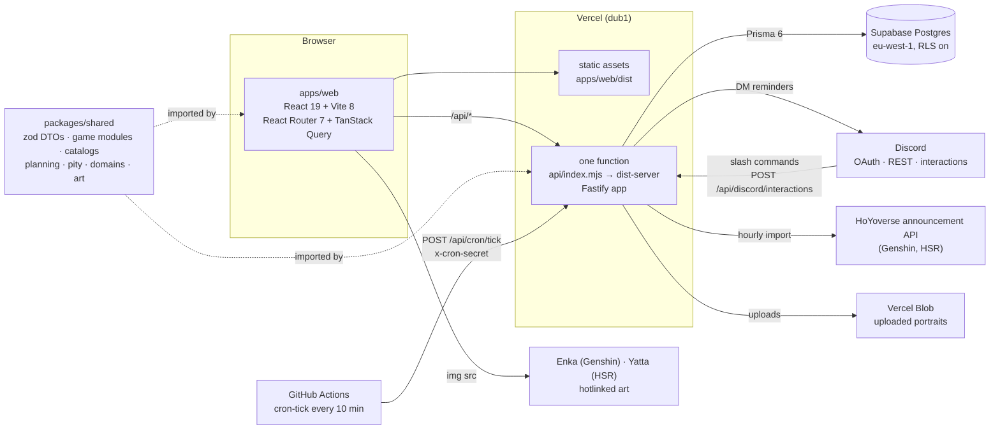
```mermaid
flowchart LR
  subgraph Browser
    W["apps/web<br/>React 19 + Vite 8<br/>React Router 7 + TanStack Query"]
  end
  subgraph Vercel["Vercel (dub1)"]
    STATIC["static assets<br/>apps/web/dist"]
    F["one function<br/>api/index.mjs → dist-server<br/>Fastify app"]
  end
  S["packages/shared<br/>zod DTOs · game modules · catalogs<br/>planning · pity · domains · art"]
  DB[("Supabase Postgres<br/>eu-west-1, RLS on")]
  GH["GitHub Actions<br/>cron-tick every 10 min"]
  DC["Discord<br/>OAuth · REST · interactions"]
  HOYO["HoYoverse announcement API<br/>(Genshin, HSR)"]
  ART["Enka (Genshin) · Yatta (HSR)<br/>hotlinked art"]
  BLOB["Vercel Blob<br/>uploaded portraits"]

  W -- "/api/*" --> F
  W --> STATIC
  S -. imported by .-> W
  S -. imported by .-> F
  F -- Prisma 6 --> DB
  GH -- "POST /api/cron/tick<br/>x-cron-secret" --> F
  F -- "DM reminders" --> DC
  DC -- "slash commands<br/>POST /api/discord/interactions" --> F
  F -- "hourly import" --> HOYO
  W -- "img src" --> ART
  F -- uploads --> BLOB
```

- **One contract.** `packages/shared` owns every request and response shape as zod schemas. The server validates inputs and parses its outputs through the same schemas, so the web types (`z.infer`) cannot drift.
- **Catalogs** are normalized JSON per game (`packages/shared/src/games/<key>/catalog.json`, about 4 MB for Genshin), loaded lazily per game on both sides and indexed once. They are typed `unknown` behind `catalog.js` + `catalog.d.ts` shims because literal inference over the JSON ran `tsc` out of memory.
- **Pure core** (unit and property tested, no I/O): reset math (`apps/server/src/lib/resets.ts`), game day and domains today (`packages/shared/src/domains.ts`), reminder due logic (`apps/server/src/scheduler/due.ts`), planning and cost math (`packages/shared/src/planning`), currency and pull math (`apps/server/src/lib/currencies.ts`), pity (`packages/shared/src/pity.ts`), feed parsing (`apps/server/src/lib/officialFeed.ts`), build-document migrations (`apps/server/src/lib/docMigrations.ts`).
- **Serverless.** Production is one Vercel function plus static files. `api/index.mjs` imports the esbuild bundle in `dist-server/` (ESM; a `.ts` entry compiled to CJS crashed with `ERR_REQUIRE_ESM`). `apps/server/src/index.ts` is the always-on entry for local dev and E2E.
- **Security headers** on every response: CSP (own scripts; images from the app, Enka, Yatta, Discord avatars, Vercel Blob), `frame-ancestors 'none'`, `nosniff`, strict referrer and permissions policies. Defined in `apps/server/src/lib/securityHeaders.ts`, mirrored in `vercel.json` for static files, and a test keeps the two equal.

**Repository layout**

```
gacha/
├── apps/web/src/          pages/ (one per route), components/, games/<key>/Sheet.tsx, lib/ (api, auth, catalog, time, toast)
├── apps/server/src/       api/ (one file per resource + *.integration.test.ts), lib/ (pure core), scheduler/, discord/, games/ (server hooks), auth/
├── packages/shared/src/   dto/, catalog/, planning/, games/<key>/ (definition + limits + catalog), domains.ts, pity.ts, art.ts, common.ts
├── prisma/                schema.prisma, migrations/ (schema.sqlite.prisma is generated)
├── scripts/               catalog/ (importers, isolated install), harness/, smoke.mjs, budget.mjs, e2e-server.mjs, vercel-build.mjs
├── e2e/                   Playwright journeys
├── api/index.mjs          Vercel function entry
└── docs/                  DESIGN.md, ENGINEERING.md, AGENT_LOG.md, PROJECT-GUIDE.md, screens/, adr/, DEPLOY.md
```

## 5. Data model

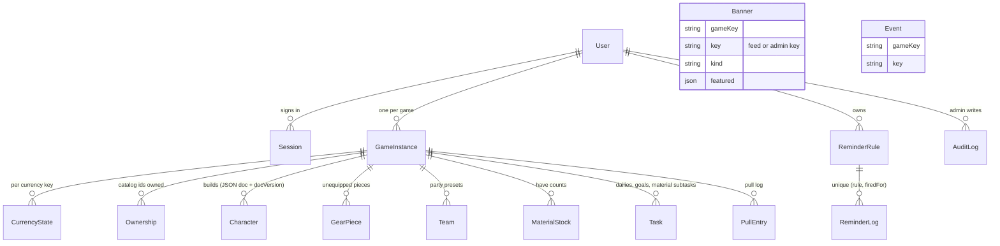
```mermaid
erDiagram
  User ||--o{ Session : "signs in"
  User ||--o{ GameInstance : "one per game"
  User ||--o{ ReminderRule : owns
  GameInstance ||--o{ CurrencyState : "per currency key"
  GameInstance ||--o{ Ownership : "catalog ids owned"
  GameInstance ||--o{ Character : "builds (JSON doc + docVersion)"
  GameInstance ||--o{ GearPiece : "unequipped pieces"
  GameInstance ||--o{ Team : "party presets"
  GameInstance ||--o{ MaterialStock : "have counts"
  GameInstance ||--o{ Task : "dailies, goals, material subtasks"
  GameInstance ||--o{ PullEntry : "pull log"
  ReminderRule ||--o{ ReminderLog : "unique (rule, firedFor)"
  User ||--o{ AuditLog : "admin writes"
  Banner {
    string gameKey
    string key "feed or admin key"
    string kind
    json featured
  }
  Event {
    string gameKey
    string key
  }
```

Games are code, not a table (`packages/shared/src/games`): `GameInstance`, `Banner` and `Event` rows carry a `gameKey`, and banners and events are shared by every user. Semantics that must not break are in §16.

## 6. Key flows

### Official feed → banners and events

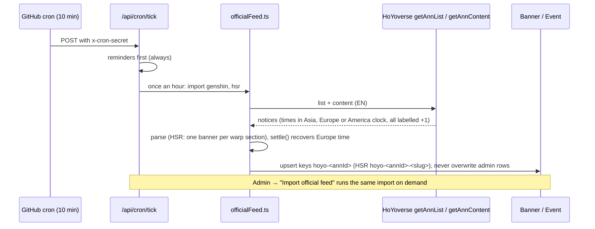
```mermaid
sequenceDiagram
  participant GH as GitHub cron (10 min)
  participant API as /api/cron/tick
  participant FEED as officialFeed.ts
  participant HOYO as HoYoverse getAnnList / getAnnContent
  participant DB as Banner / Event
  GH->>API: POST with x-cron-secret
  API->>API: reminders first (always)
  API->>FEED: once an hour: import genshin, hsr
  FEED->>HOYO: list + content (EN)
  HOYO-->>FEED: notices (times in Asia, Europe or America clock, all labelled +1)
  FEED->>FEED: parse (HSR: one banner per warp section), settle() recovers Europe time
  FEED->>DB: upsert keys hoyo-<annId> (HSR hoyo-<annId>-<slug>), never overwrite admin rows
  Note over API,DB: Admin → "Import official feed" runs the same import on demand
```

### Reminders

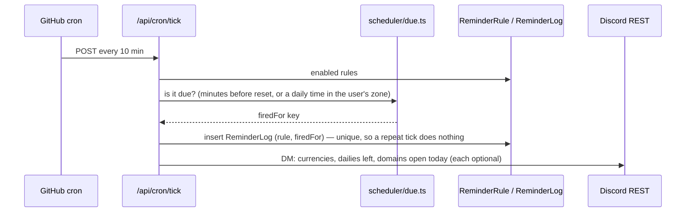
```mermaid
sequenceDiagram
  participant GH as GitHub cron
  participant API as /api/cron/tick
  participant DUE as scheduler/due.ts
  participant DB as ReminderRule / ReminderLog
  participant D as Discord REST
  GH->>API: POST every 10 min
  API->>DB: enabled rules
  API->>DUE: is it due? (minutes before reset, or a daily time in the user's zone)
  DUE-->>API: firedFor key
  API->>DB: insert ReminderLog (rule, firedFor) — unique, so a repeat tick does nothing
  API->>D: DM: currencies, dailies left, domains open today (each optional)
```

### Planning: from a goal to farmable tasks

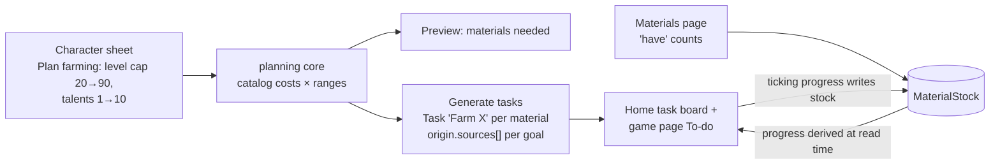
```mermaid
flowchart LR
  A["Character sheet<br/>Plan farming: level cap 20→90,<br/>talents 1→10"] --> B["planning core<br/>catalog costs × ranges"]
  B --> C["Preview: materials needed"]
  B --> D["Generate tasks<br/>Task 'Farm X' per material<br/>origin.sources[] per goal"]
  D --> E["Home task board +<br/>game page To-do"]
  F["Materials page<br/>'have' counts"] --> G[("MaterialStock")]
  G -- "progress derived at read time" --> E
  E -- "ticking progress writes stock" --> G
```

Inventory is the source of truth: a "Farm X" task stores the raw total; its progress is read from `MaterialStock`. Re-planning the same goal replaces its `origin.sources[]` entry, so generation is idempotent.

### Pull log and pity (ADR 0002)

A `PullEntry` is `{bannerType, count, fiveStar?, featured?}`. Pity is the count since the last 5★; the guarantee is on when the last 5★ was not the featured one. "Set pity" writes a zero-count calibration marker so people starting mid-pity do not have to replay history. Each game's `pullBanners` gives hard pity, the featured rate (50% character, 75% Genshin/HSR/ZZZ weapon, 100% WuWa weapon) and whether a guarantee exists.

## 7. Screen map

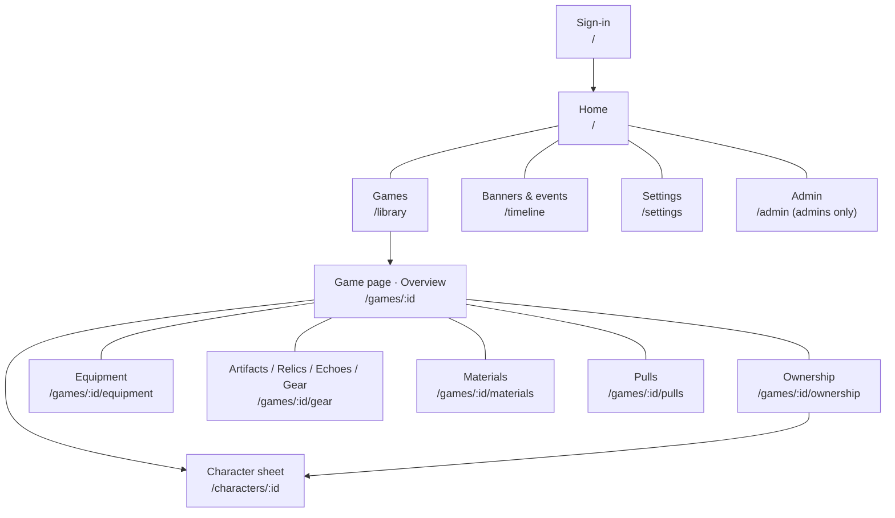
```mermaid
flowchart TB
  L["Sign-in<br/>/"] --> H["Home<br/>/"]
  H --- G["Games<br/>/library"]
  H --- C["Banners & events<br/>/timeline"]
  H --- S["Settings<br/>/settings"]
  H --- AD["Admin<br/>/admin (admins only)"]
  G --> O["Game page · Overview<br/>/games/:id"]
  O --- OW["Ownership<br/>/games/:id/ownership"]
  O --- EQ["Equipment<br/>/games/:id/equipment"]
  O --- GR["Artifacts / Relics / Echoes / Gear<br/>/games/:id/gear"]
  O --- MA["Materials<br/>/games/:id/materials"]
  O --- PU["Pulls<br/>/games/:id/pulls"]
  O --> CH["Character sheet<br/>/characters/:id"]
  OW --> CH
```

The left sidebar is on every signed-in page: Home, Games, Banners & events, Settings, Admin (hidden from non-admins), then one link per installed game. Which game tabs appear depends on the game (§9): no catalog means only Overview and Pulls; no `pullBanners` means no Pulls tab.

## 8. Screen by screen

Screenshots are from the local dev build (dev user, SQLite) on 2026-10-08, 1440×900. Several show test data typed during development (builds named "ok", an "Example Banner").

### 8.1 Sign-in

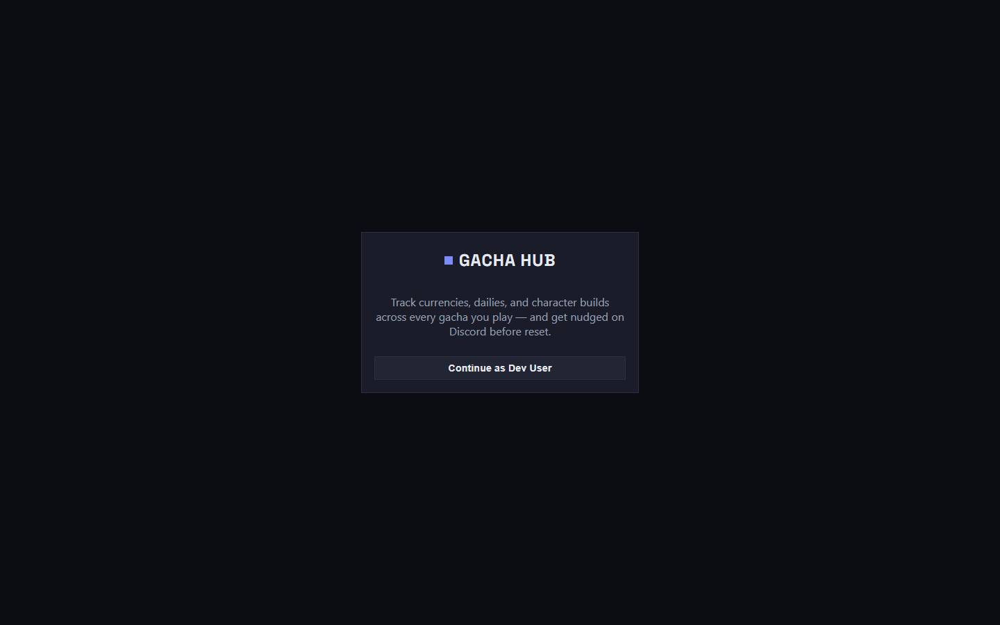

**For:** getting in. One card: the product line ("Track currencies, dailies, and character builds across every gacha you play — and get nudged on Discord before reset") and one button. In production the button is "Sign in with Discord" (OAuth); locally it is "Continue as Dev User" when `DEV_LOGIN_ENABLED=true`. Whitelisting is by Discord account; there is no sign-up.

### 8.2 Home


**For:** the one-screen answer to "what should I do today, across all my games?". It is the most important screen.

- **KPI strip** (choose which with "Customize"): pulls available across games, dailies done this reset, characters owned (% of catalog), builds finished (good or perfect), goal materials farmed.
- **Banners now:** one card per running banner across games, with the featured units' art; a green "owned" tag on units you already have. Helps decide whether a banner is worth pulls.
- **Pulls (right):** limited pulls per game, converted from premium currency plus tickets (Genshin: Primogems ÷ 160 + Intertwined Fates; standard tickets shown apart as "+3 std"). Under each game with a pull log: current pity per banner and "guaranteed" when the next 5★ is the featured one.
- **Coming up:** banners and events ending soonest, with countdowns; links to the calendar.
- **Wallet:** every currency per game, collapsed by game.
- **Today:** per game, the time to the next daily reset, the regenerating stamina bar (Genshin resin shows "full — spend it"), and the unticked dailies as chips you click to tick.
- **Tasks:** the task board, one column per game: goal tasks ("Farm Venti" with a progress counter, "Farm Faded Theater" with artifact-piece subtasks), filter, Dailies and Backlog toggles, "+ New task".

Data: `GET /api/dashboard` (games, currencies, pulls and pity, banners now, coming up, goals) and `GET /api/tasks`.

### 8.3 Games (library)


**For:** managing which games you track, and a compact status line per game. One long card per installed game, coloured by the game's accent: region, owned/catalog size, builds finished, pulls (in the game's own word: wishes, warps, signals, convenes, headhunts), dailies done, goals, the current banner. Buttons: Open, Ownership, the game's gear page (Artifacts, Relics, Echoes, Gear) and **Put to sleep** (a sleeping game is hidden from Home and sends no reminders, without losing data; it sorts to the bottom here). "+ Add game" on Home installs a game; installing seeds its default dailies.

### 8.4 Banners & events (calendar)

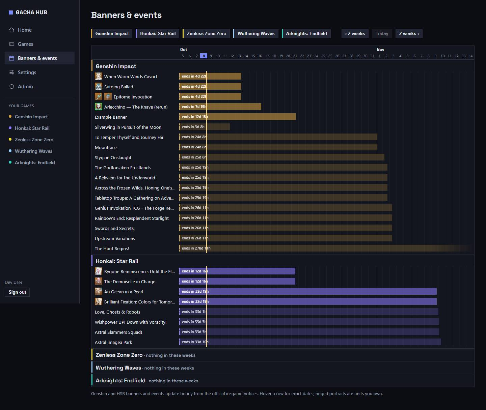

**For:** seeing what is running and what ends soon, across games, on one timeline. A Gantt-style view of four weeks around today (the yellow line), grouped by game; banners are solid bars, events lighter ones, each labelled with its countdown. Banner rows show the featured units' portraits (ringed when owned). Game chips filter; "‹ 2 weeks / Today / 2 weeks ›" pages, including back into ended banners (F7). Hover a row for exact dates. Genshin and HSR rows come from the hourly official-feed import; other games only have what an admin uploads.

Data: `GET /api/timeline?from&to` (window query; banners carry their featured details).

### 8.5 Game page: Overview

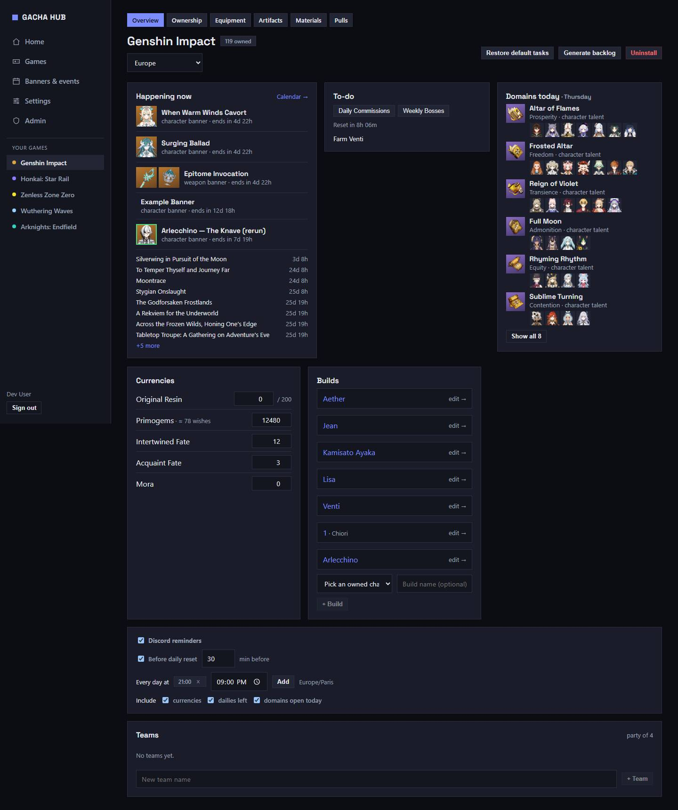

**For:** "what should I do in this game right now?". Tabs at the top move between the game's screens.

- **Header:** region picker (sets reset times), owned count, **Restore default tasks**, **Generate backlog** (a "Farm X (max)" goal tree per owned character, everything needed to max it, kept in the Backlog out of the active list), **Uninstall**.
- **Happening now:** running banners with featured art, then events with time left; "+N more" expands; links to the calendar.
- **To-do:** dailies as chips, time to reset, active goals.
- **Domains today** (Genshin only, §9): the talent and weapon domains open on today's *game day* (the server weekday shifted by the 04:00 reset), each with portraits of the owned characters who level from it. "Show all 8" expands.
- **Currencies:** every currency with its cap; premium currency shows its pull equivalent ("≈ 78 wishes").
- **Builds:** your builds; "Pick an owned character" + optional build name + "+ Build" adds one (catalog games). Games without a catalog (ZZZ) take a free-text name.
- **Discord reminders:** on/off; "before daily reset" N minutes; "every day at" chosen times in your time zone; what to include: currencies, dailies left, domains open today (the last only where the game has domains).
- **Teams:** saved party presets of the game's party size (4 for Genshin, HSR and Endfield, 3 for ZZZ and WuWa).

The ZZZ overview shows the reduced version for a game without a catalog:

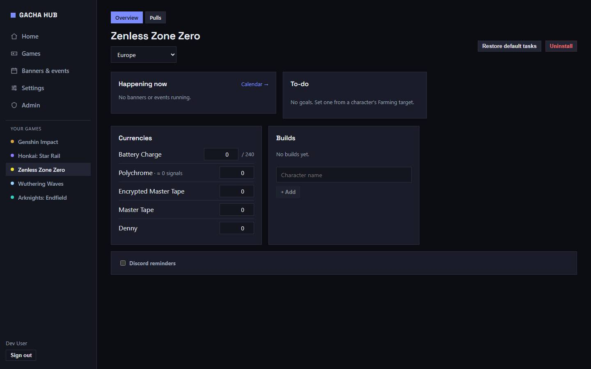

### 8.6 Ownership

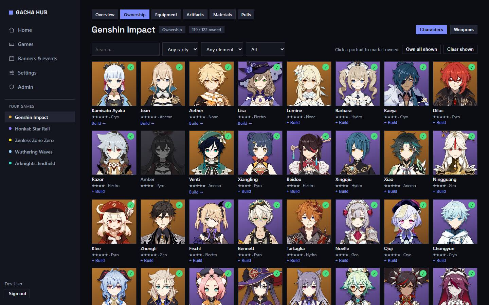

**For:** the fastest possible "which characters (and weapons) do I have?" entry, which drives everything else (Home's "owned" tags, Domains today, Generate backlog). A portrait grid of the whole catalog; click a portrait to toggle owned (check mark, full colour; unowned is greyed). Filters: search, rarity, element, owned/unowned; **Own all shown** and **Clear shown** for bulk entry. Characters/Weapons toggle. Each card links to its build ("Build →") or creates one ("+ Build").

HSR uses the same screen with Yatta art:

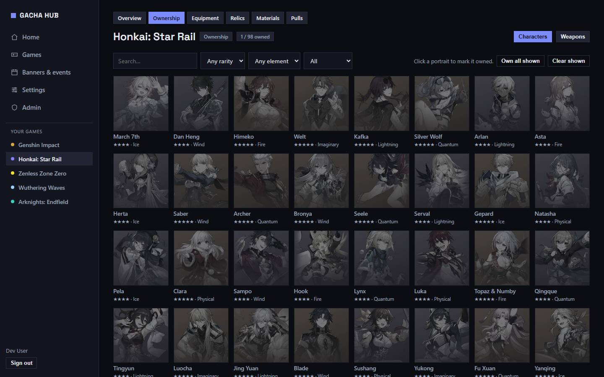

### 8.7 Equipment

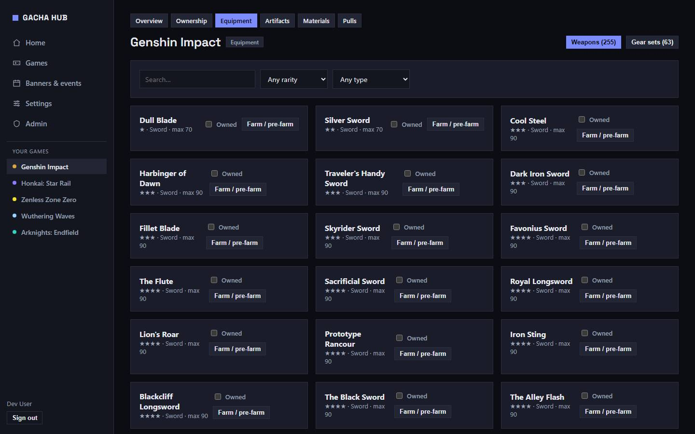

**For:** browsing the weapon catalog (and gear sets) to mark owned weapons and to plan farming for one. Each card shows rarity, weapon type and max level; **Owned** toggles ownership; **Farm / pre-farm** opens the plan for that weapon's ascension materials, so you can pre-farm before a banner. Tabs: Weapons (255) and Gear sets (63).

### 8.8 Gear: Artifacts (Genshin), Relics (HSR), Echoes (WuWa), Gear (Endfield)

Every catalog game has a set browser. Genshin has two more modes, because artifacts are the main grind there.

**Sets:** every set with its 2-piece and 4-piece bonus, rarity and the domain it drops from; a "used by my builds" filter, and green tags naming which of your builds wear it.

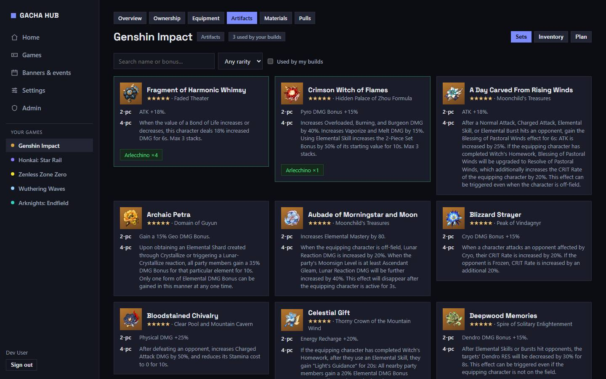

**Inventory (Genshin):** the bag of pieces you own: set, slot, main stat, level, substats, crit value (CV); filter by set, slot, bag or equipped; sorted by CV. **Equip on…** puts a bag piece on a build (swapping out what was there); **Unequip** returns it to the bag. Only unequipped pieces live in `GearPiece`; equipped ones live in the build document.

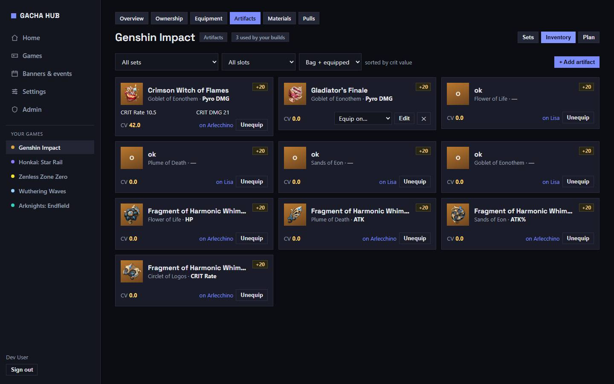

**Plan (Genshin):** groups the farming targets set on each build (4-piece set plus wanted sands, goblet and circlet main stats) by the domain that drops them, shows which wanted pieces you already have (✓) or still need (✗), and **Update task** turns that into a goal task with one subtask per missing piece.

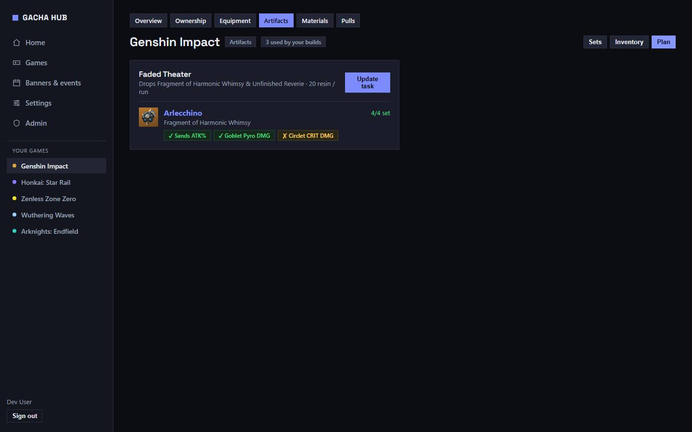

### 8.9 Materials

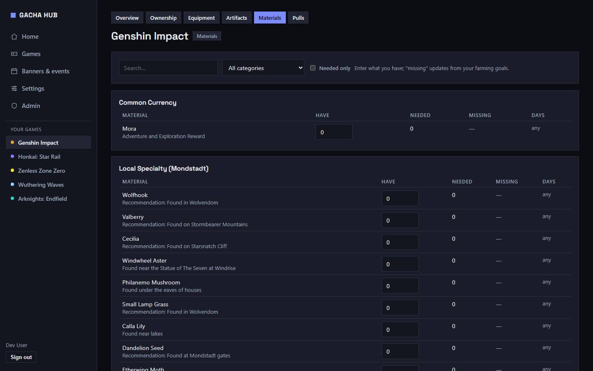

**For:** entering what you have, so goals know what is still missing. Grouped by category (Common currency, Local specialty per region, talent books, boss drops…), each row has **Have** (editable), **Needed** (from your goal tasks), **Missing**, and **Days** (the weekdays it can be farmed; "any" when always). "Needed only" hides what no goal uses. Editing "have" here is the same write as ticking progress on a "Farm X" task.

### 8.10 Pulls

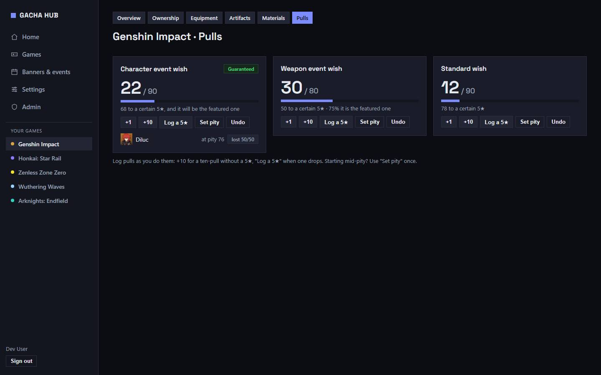

**For:** knowing how close the next 5★ is and whether it is guaranteed to be the featured one. One card per banner type (Genshin: Character event wish 90, Weapon event wish 80, Standard wish 90). Each shows pity / hard pity, a bar, the plain-language outlook ("68 to a certain 5★, and it will be the featured one"), **+1**, **+10** (a ten-pull without a 5★), **Log a 5★** (who, and whether it was the featured unit), **Set pity** (start mid-pity) and **Undo**. The 5★ history lists who dropped at which pity and whether the 50/50 was lost. The Pulls tab exists for Genshin, HSR, ZZZ and WuWa (Endfield has no pull rules yet).

### 8.11 Character sheet

**For:** recording a build and planning what it still needs. Every game has its own sheet, because builds differ in kind, not just in labels (§9). Common frame: Back, the build name and game tag, a status (Unbuilt, Building, Good, Perfect; Good and Perfect count as "builds finished"), Save and Delete.

**Genshin** (the reference sheet, catalog-backed):

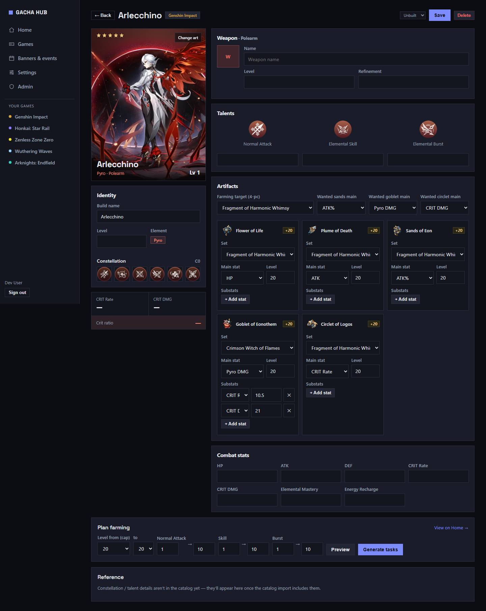

- Portrait card with art (Enka fallback, or an uploaded image via "Change art"), rarity, element, weapon type, level.
- Identity: build name, level, element (fixed from the catalog), constellation C0–C6 as icons.
- Weapon (filtered to the character's weapon type), level, refinement.
- Talents: Normal Attack, Elemental Skill, Elemental Burst with their icons.
- Artifacts: five slots, each with set, main stat (only the main stats that slot can roll), level and substats; a **farming target** (4-piece set and wanted sands, goblet and circlet main stats) that the Artifacts → Plan mode reads.
- Crit summary: CRIT Rate, CRIT DMG and the crit ratio; combat stats (HP, ATK, DEF, crit, EM, ER).
- **Plan farming:** level cap from → to and talent levels from → to; **Preview** lists the materials, **Generate tasks** creates the goal (see §6). "View on Home" jumps to the board.
- Reference: constellation and talent text (empty until the catalog import includes it).

**HSR** (plain form): Light Cone (name, level, superimposition), six relic slots (head, hands, body, feet, planar sphere, link rope), traces, eidolon, path, element, stats. The build name in the screenshot predates the HTML-stripping fix in #21.

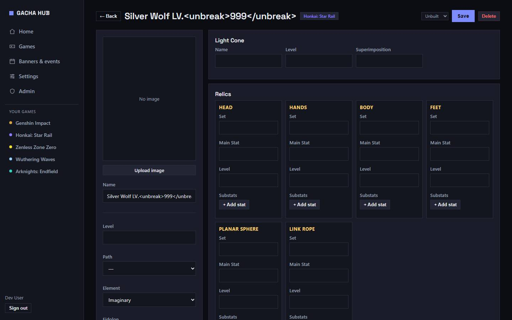

**Endfield** (plain form): Weapon & Essence (an essence attaches to the weapon), four gear slots, combat skill and ultimate, class, potential.

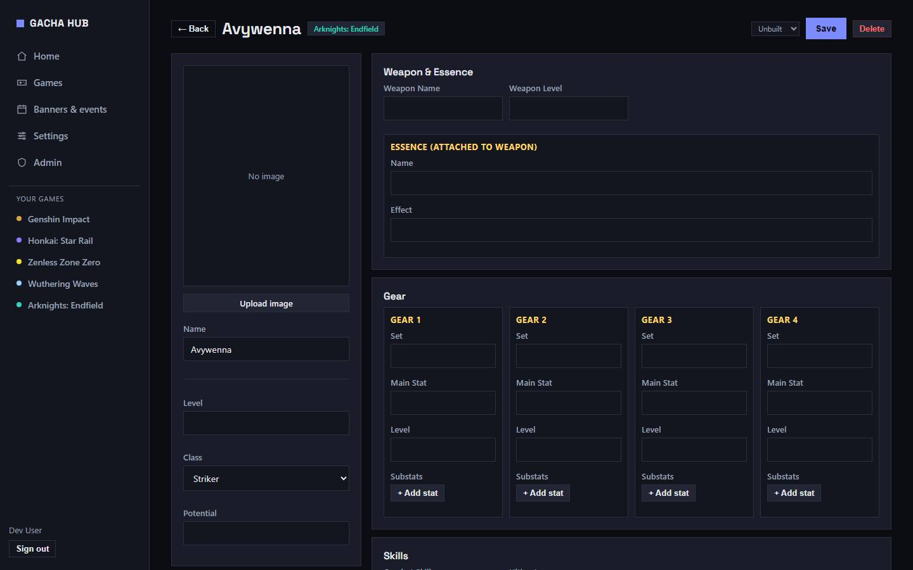

**ZZZ** (free text, no catalog): W-Engine, drive discs, skills (basic, special, chain…), mindscape. **WuWa**: weapon, echoes (with cost, main stat, sonata set), forte (basic attack, resonance skill, forte circuit, liberation, intro skill), resonance chain.

### 8.12 Settings

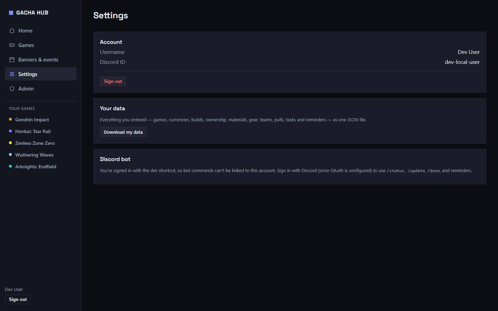

Account (username, Discord id, sign out); **Your data → Download my data** (one JSON file with every game, currency, build, ownership, material, gear piece, team, pull, task and reminder you entered; nothing of other users, no secrets); **Discord bot** (how to use `/status`, `/update`, `/done` and reminders; the dev user cannot link the bot).

### 8.13 Admin

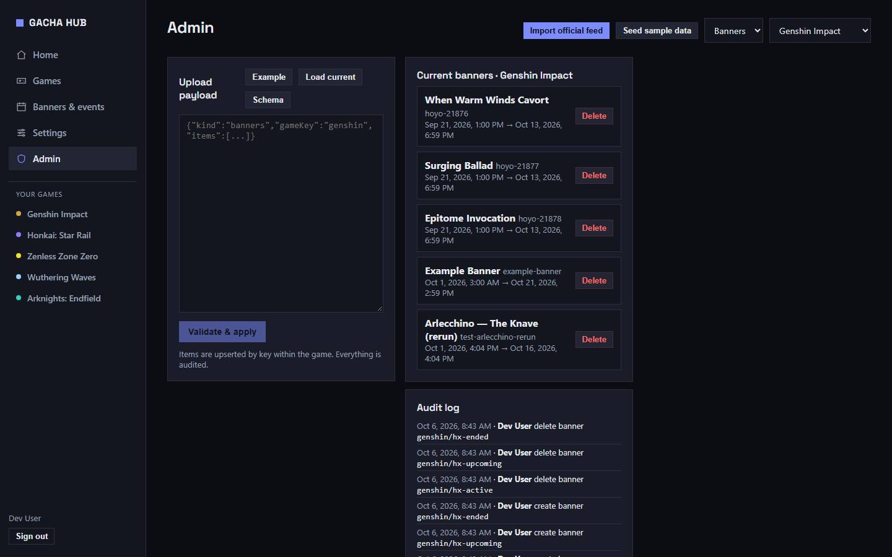

**For:** keeping banners and events correct, for admins only (`ADMIN_DISCORD_IDS`).

- **Import official feed** for the selected game (Genshin, HSR, ZZZ; also runs hourly from the cron).
- **Seed sample data** (two sample banners and events, to preview the UI; delete them in production once the feed runs).
- **Upload payload:** paste JSON (kind banners or events, a game, items), **Example** fills a template, **Load current** loads what is live for editing, **Schema** shows the JSON schema, **Validate & apply** upserts by key with precise errors (unknown catalog ids, duplicate keys, field issues).
- **Current banners/events** with Delete; feed rows have `hoyo-…` keys.
- **Audit log:** every admin write with actor, action and target.

### 8.14 Discord bot (no screen)

Slash commands through HTTP interactions (`POST /api/discord/interactions`, signature-checked): `/status`, `/update` (a currency), `/done` (tick a daily), `/currency`, `/own`, `/build`, `/goal`, `/farm` (materials you still need that are farmable today), `/banner`, `/events`, plus Genshin's `/resin`. Commands are registered with `npm run discord:register -w @gacha/server` once the bot variables are set. The same account links through Discord OAuth, so commands act on the signed-in user's data.

## 9. Game-specific features

### Why every game has its own module

The games look alike from far away (a premium currency, a gacha, daily resets, characters with gear) and differ in every detail that matters for planning:

- **Builds have different shapes.** A Genshin character has 5 artifacts with fixed main-stat pools per slot and 3 talents; an HSR character has 6 relics split into cavern and planar sets plus traces; a WuWa character has echoes with a cost budget and sonata sets; Endfield attaches an essence to the weapon. One generic form would either lose these rules or turn into a form builder, which the owner ruled out.
- **Planning data differs.** Genshin talent books and weapon materials drop on fixed weekdays, which is what "Domains today" and the "domains open today" DM are for; HSR and WuWa materials are farmable every day, so the same screen would be noise there.
- **The gacha rules differ.** Hard pity is 90/80 in HoYoverse games but 80 for every WuWa banner; WuWa's weapon banner is always the featured weapon (100%), Genshin's and HSR's are 75%. The pull log's arithmetic is the same; its rules are per game.
- **Data sources differ.** Each catalog comes from a different open dataset with its own quirks (genshin-db, Project Yatta, a WuWa dataset, an Endfield dump with int64 ids). ZZZ has no usable dataset with costs, so it has no catalog. NTE's terms forbid third-party tools, so it is typed by hand.
- **Each game skins itself** (Genshin gold, HSR violet, ZZZ green, WuWa sky blue, Endfield yellow, NTE blue) and uses its own vocabulary (wish, warp, signal, convene, headhunt, roll; artifacts, relics, drive discs, echoes, gear, console cartridges).

So the host app stays generic over what all games share (profiles, currencies, resets, tasks, reminders, banners, pull log), and each game supplies a `GameDefinition` (`packages/shared/src/games/<key>`), a sheet (`apps/web/src/games/<key>/Sheet.tsx`) and optional server hooks (`apps/server/src/games/<key>.ts`).

### Feature matrix

| | Genshin | HSR | ZZZ | WuWa | Endfield | NTE |
| --- | --- | --- | --- | --- | --- | --- |
| Catalog (chars / weapons / sets / materials) | 122 / 255 / 63 / 536 (genshin-db) | 98 / 170 / 62 / 134 (Project Yatta) | none: no dataset with costs | 50 / 112 / 29 / 128 (WutheringData) | 29 / 0 / 0 / 0 (EndFieldGameData) | none: typed by hand |
| Hub tabs besides Activities, Endgame, Pulls, Characters, Profile | Artifacts, Planner | Relics, Planner | — | Echoes, Planner | — (characters only, #175) | — |
| Character sheet | the shared sheet: catalog weapon picker, main stats per slot, sets, KPIs, splash art | same | same, names typed | same, with the echo cost cap | same, operator list | same, names typed; Console cartridges |
| Plan farming (levels, talents → tasks) | yes | yes | — | yes | no costs in the dataset | — |
| Domains today, "domains open today" DM | yes | — | — | — | — | — |
| Pull log (hard pity, featured rate) | 90 50% · 80 75% · 90 | 90 50% · 80 75% · 90 | 90 50% · 80 75% · 90 | 80 50% · 80 100% · 80 | 80 50% (featured at 120) · 40 25% (featured at 80) · 80 | 90 100% |
| Pull history import | history link, UIGF | history link, UIGF | history link, UIGF | convene link | records link (ADR 0009) | — (by hand) |
| Live account data | HoYoLAB notes, chronicle, roster; Enka builds | same | HoYoLAB notes, chronicle, roster | — | — (the account token can act for the account) | — |
| Official feed import | yes | yes (one banner per warp section) | yes (one banner per Signal Search) | — | — | — |
| Art (behind our R2 store once set up) | Enka | Yatta | initials | Wuthery (characters, weapons) | initials | initials |
| Party size | 4 | 4 | 3 | 3 | 4 | 4 |
| Regions | NA (UTC−5), EU (UTC+1), Asia (UTC+8); reset 04:00 | same | same | same | Americas/Europe (UTC−5), Asia (UTC+8); reset 04:00 | Asia, America, Europe, SEA; reset 05:00, week on Monday |
| Default dailies | Daily Commissions; Weekly Bosses (weekly) | Daily Training; Assignments; Simulated Universe (weekly) | Daily Missions; Scratch Card | Daily Activity; Weekly Bosses (weekly) | Daily Tasks | Daily quests; Anomaly Pilgrimage (weekly) |
| Currencies | Original Resin (200, 7.5/h), Primogems (160/wish), Intertwined Fate, Acquaint Fate (standard), Mora | Trailblaze Power (300, 10/h), Stellar Jade (160/warp), Special Pass, Star Rail Pass (standard), Credits | Battery Charge (240), Polychrome (160/signal), Encrypted Master Tape, Master Tape (standard), Denny | Waveplate (240), Astrite (160/convene), Radiant Tide, Lustrous Tide (standard), Shell Credits | Sanity (360), Oroberyl (500/headhunt) | Character Pixels (240, 10/h), Annulith (160/roll), Solid Dice, Fabricated Dice (standard), Fons |
| Server hooks | `/resin`, resin projection on Home | — | — | — | — | — |

### Per game, and why

- **Genshin Impact** is the flagship and the reference implementation: the richest catalog, the only weekday-gated materials (hence Domains today and the domains DM), the only game with an artifact inventory and planner (artifact farming is the main long-term grind and the 5-slot main-stat rules are well defined), and official-feed import. New per-game work should copy its patterns.
- **Honkai: Star Rail** shares HoYoverse's gacha rules, announcement API, history link and HoYoLAB, so it gets the same imports and sync. Its feed notices bundle several warps per notice, so the parser splits them into one banner per section with its own dates. Its relic stat tables come from Enka's store so showcases can be read.
- **Zenless Zone Zero** has no open dataset with upgrade costs, so it is currencies, dailies, pulls (with the history link) and HoYoLAB sync, with builds typed by hand. Do not hand-type a catalog (locked decision); revisit when a dataset appears.
- **Wuthering Waves** has a catalog with costs (so ownership, materials and planning work) and its own gacha rules (80 pity everywhere, 100% featured weapon). Echoes have a cost budget, which is why its sheet has a cost cap. Its pulls import from the convene link, and its art comes from Wuthery's copy of the game's textures.
- **Arknights: Endfield** has a character list only (the dataset has no upgrade costs), so ownership works and planning does not; its hub has no Gear or Planner tab. Its pulls import from the records link (ADR 0009). Its account data stays manual: only the SKPORT account token reaches it, and that token can act for the account.
- **Neverness to Everness** (Perfect World) is tracked by hand only (capability M, ADR 0004): its terms forbid third-party tools, so there are no imports, no catalog and no art. The manifest still gives it everything shared: resets at 05:00 on four servers, currencies and stamina, the Limited Board's pity (90, no 50/50), Beyond the Rails, the battle pass and monthly pass, and the shared sheet with its Console cartridges.

## 10. Cross-cutting features

- **Tasks and goals.** Three kinds: recurring dailies/weeklies (reset with the game day), goal tasks ("Farm X", with derived progress), and checklists (artifact pieces). Priority, backlog, notify flag. Board on Home, To-do on the game page.
- **Generate backlog.** A "Farm X (max)" goal tree per owned character, kept apart from manual plans (matched by origin and the backlog flag), for completionists.
- **Builds.** Several named builds per character; status Unbuilt, Building, Good or Perfect feeds the "builds finished" KPI. Build documents are versioned and migrated lazily on read.
- **Teams.** Saved party presets per game, sized by the game's party size.
- **Reminders.** Before-reset and at-time rules per game profile; idempotent per `(rule, firedFor)`; DM content options.
- **Export.** `GET /api/export`, round-trips every user-owned table.
- **Limits.** Every number has a hard limit (`LIMITS`), enforced by the zod DTOs.
- **Art.** Our own copy first (`VITE_ASSET_BASE`: the R2 bucket the `mirror-art` workflow fills, ADR 0006; unset until Georges creates it), then the community fallback (`communityArtUrl` in `packages/shared/src/art.ts`: Enka for Genshin, Yatta for HSR), then initials. Source-internal paths (WuWa Unreal paths) are skipped instead of requested.
- **Security.** Discord-only auth, signed session cookie, admin routes rate-limited and audited, cron endpoint behind `CRON_SECRET`, CSP and hardening headers, RLS on every table.

## 11. API map

All under `/api`, JSON, session cookie. Inputs and outputs are zod DTOs from `packages/shared/src/dto`.

| Resource | Routes |
| --- | --- |
| Auth | `GET /auth/discord`, `GET /auth/discord/callback`, `POST /auth/dev-login`, `POST /auth/logout`, `GET /me` |
| Games | `GET /games`, `GET /games/:key/banners?status=active\|ended\|all`, `GET /games/:key/events` |
| Profiles | `GET/POST /instances`, `GET/PUT/DELETE /instances/:id` (region, sleeping), `PUT /instances/:id/currencies/:key`, `POST /instances/:id/tasks/defaults`, `POST /instances/:id/backlog/generate`, `GET/PUT/DELETE /instances/:id/reminder` |
| Ownership | `GET/PUT /instances/:id/ownership` |
| Builds | `GET/POST /instances/:id/characters`, `GET/PUT/DELETE /characters/:id`, `POST /characters/:id/unequip` |
| Gear | `GET/POST /instances/:id/gear`, `PUT/DELETE /gear/:id`, `POST /gear/:id/equip` |
| Materials and planning | `GET/PUT /instances/:id/materials`, `GET /instances/:id/materials/needed`, `POST /instances/:id/plans/preview`, `POST /instances/:id/plans/generate` |
| Tasks | `GET/POST /tasks`, `PUT/DELETE /tasks/:id`, `POST /tasks/:id/complete` (an event goal applies or reverses its effects), `POST /tasks/:id/progress`, `PUT /tasks/:id/checklist`, `POST /events/:id/goal` (make or re-pick an event goal, ADR 0008), `GET /rewards` (open roster rewards with each option's step and the goal), `GET /farm-today` (per profile: materials open on its game day for each farming goal, weeklies left), `GET /reminders/preview` (the DM each game would send now), `POST /reminders/test` (send it to yourself) |
| Teams | `GET/POST /instances/:id/teams`, `PUT/DELETE /instances/:id/teams/:teamId` |
| Pulls | `GET/POST /instances/:id/pulls`, `DELETE /instances/:id/pulls/:entryId`, `POST /instances/:id/pulls/calibrate`, `POST/GET /instances/:id/pulls/uigf` (UIGF v4.2 import, `?uid=` to pick an account; export), `POST /instances/:id/pulls/history-link` (`{url, next?}`: pages the official log, returns `next` to call again with) |
| Linked accounts | `GET /links` (never the secret), `DELETE /links/:id` (revoke), `POST /links/hoyolab` (`{ltuid, ltoken}`: checked with HoYoLAB, sealed, fills the profiles it plays; 503 without `LINK_SECRET_KEY`), `POST /links/:id/sync` (real-time notes now; the cron does it every 30 minutes) |
| Account | `GET /imports` (latest imports and syncs), `DELETE /me` (`{confirm: username}`) |
| Showcase | `POST /instances/:id/enka` (Genshin builds from the Enka showcase by the profile's UID) |
| Home, calendar, export | `GET /dashboard`, `GET /timeline?from&to`, `GET /export` |
| Admin | `POST /admin/payload`, `GET /admin/payload/schema`, `GET /admin/export`, `DELETE /admin/:kind/:gameKey/:key`, `POST /admin/feed/:gameKey`, `GET /admin/audit` |
| Platform | `POST /cron/tick` (x-cron-secret), `POST /discord/interactions` (signed), `POST /uploads` (Blob) |

Handlers are in `apps/server/src/api/*.ts`; the integration tests next to them show each route in use.

## 12. Process and quality gates

The workflow is the portfolio standard (`docs/ENGINEERING.md`, synced from portfolio-infra) plus `AGENTS.md`:

- **Test first.** Failing test, commit `test(<area>): …`, then `feat|fix(<area>): …`. Never weaken a test.
- **Small stacked PRs** (about 400 changed lines), branches `stack/<topic>/<nn>-<slug>`, Conventional Commits, PR template, drafts until CI is green; the owner merges.
- **Always `gh pr create --head <branch>`** and check the diff size (#57 once squashed twelve PRs into one because a rebase left the wrong branch checked out). Retarget the next PR to `main` *before* deleting a merged base branch (deleting first closed #41 for good).
- **Check all:** `npm run check` = generate Prisma client → lint → typecheck → tests → build → budget → E2E. Stop the dev server first on Windows (it locks the Prisma engine DLL).
- **CI** (`ci.yml`): `lint`, `typecheck`, `test`, `build` (+ budget once #78 merges), `e2e`; all required.
- **Tests:** Vitest unit, fast-check properties (game day across regions and reset hours; pity), route integration tests over a throwaway SQLite database, bundle harnesses (`npm run harness`), Playwright journeys (`e2e/`: sign-in lands on Home, adding Genshin shows today's domains, the calendar, pulls, export, no CSP violations; the axe journey joins when the a11y branch lands). Journeys share one database, so newer ones use HSR to stay independent.
- **Budget:** initial JS at most 200 KB gzipped (149 KB on 2026-10-06), `npm run budget`.
- **Vercel previews** are off for `stack/**` and `dependabot/**` (Hobby allows 100 deployments a day; restacking burned through it once).
- **PR memes:** the owner's portfolio workflow (`pr-meme.yml`, from #80) and the agent's own `pr-meme` skill add a meme on open and before merge or close.
- **Logs:** an `docs/AGENT_LOG.md` entry per PR; `HANDOFF.md` rewritten every session; ADRs for scope changes.

## 13. Work state

As of 2026-10-08, `main` at `36edfc0` (docs(agents): read and rewrite HANDOFF.md every session, #83), deployed, smoke green.

**Merged history, by milestone:** phases 1–9 (#1–#9: foundation, catalogs, ownership, planning, banners/admin, integration tests, deploy runbook); product iterations #14–#39 (tasks board, builds, teams, artifacts sets/inventory/planner, reminders at chosen times, Home rebuild, design pass, sleep); process P (#42–#44); F1 feed + calendar (#40, #49); F2–F4 (domains core, farm-today DM, HSR feed); F5 pull log (#60, #62); P2 smoke (#66); F6 export (#67); F7 calendar history (#68); hardening and upgrades (#63–#77: art fix, Dependabot groups, Fastify plugins, harness DB, node-cron 4, Vitest 5, Vite 8, React 19, React Router 7, CSP, zod 4); #80 PR memes; #81–#83 standards sync and the handoff procedure.

**Open PRs** (both draft, CI green, waiting for the owner):

| PR | Branch | What |
| --- | --- | --- |
| #78 | `stack/perf/01-budget` | CI fails when initial JS passes 200 KB gzipped |
| #79 | `stack/ops/03-prisma7-prep` (on #78) | Prisma-7-ready scripts (absolute SQLite URLs, no `--accept-data-loss`), Prisma 7 spike recorded in ADR 0003 |

**Branches with unmerged work:**

- `stack/a11y/01-axe` (on #79): `49c113c` an axe E2E test (no serious violations on the main pages), `b2066a6` WIP accessible names (a `FieldLabel` context with `aria-labelledby` in `components/inputs.tsx`). Not a PR yet; the test still fails (§14.2).
- `spike/prisma7`: the Prisma 7 experiment. Never merge; ADR 0003 holds the findings.
- Many old `feat/*`, `fix/*`, `ui/*` remote branches belong to merged PRs and can be deleted.

## 14. To do

Every milestone in DESIGN.md §9 is built, V through F12. What is left waits on the owner, on a data source, or is optional. `HANDOFF.md` holds the current state.

### 14.1 Needs the owner (an agent cannot do these)

1. **Turn on the cron:**
   1. Create one random secret.
   2. Set it as `CRON_SECRET` in Vercel (Production) and as the GitHub Actions secret `CRON_SECRET`. `CRON_URL` is already set.
   3. Redeploy.

   The next tick then runs reminders, the HoYoLAB sync and, hourly, the official feed import.
2. **Turn on DMs** (`docs/DEPLOY.md` has the steps):
   1. Set `DISCORD_BOT_TOKEN` in Vercel, and check `DISCORD_APP_ID` and `DISCORD_PUBLIC_KEY`.
   2. Invite the bot to a server you share with the users. A bot can only DM people it shares a server with.
   3. Register the slash commands: `npm run discord:register -w @gacha/server`, with the bot variables set.
   4. Set the Interactions Endpoint URL to `https://gacha-hub-two.vercel.app/api/discord/interactions`.
3. **Turn on linking:** set `LINK_SECRET_KEY` in Vercel (32 random bytes, base64). Until then, linking answers "off" (ADR 0005).
4. **Turn on the art store** (`docs/DEPLOY.md` §7):
   1. Create the R2 bucket with public `r2.dev` access, and an API token.
   2. Add `R2_ACCOUNT_ID`, `R2_ACCESS_KEY_ID`, `R2_SECRET_ACCESS_KEY` and `R2_BUCKET` as Actions secrets.
   3. Run the **mirror-art** workflow.
   4. Set `VITE_ASSET_BASE` in Vercel and redeploy.

   F12's acceptance ("every game shows art from our store") is checked after this.
5. **Clean production banners and events:** in Admin, delete the `sample-*` rows for each game. Then import the official feed, or wait for the hourly tick after step 1.
6. **Branch ruleset on `main`:** require the checks `lint`, `typecheck`, `test`, `build` and `e2e`.
7. **Decisions:** taken by the agent on 2026-10-10 at Georges's request. ADR 0009 is accepted; Enka's store data is used with credit in NOTICE and removed on request.
8. **Real responses, with tokens removed,** to replace the fixtures: the HoYoLAB card, notes, chronicle and roster; a gacha log page; a WuWa convene answer; Enka showcases.
9. **README:** record the demo GIF (DESIGN.md §15); set the repository description and topics.
10. **Delete stale remote branches** of merged PRs. The agent's delete was blocked by its permission rules:
    - `stack/docs-v2/01-design-adrs` to `06-design-files`;
    - `stack/docs/01-guide`, `stack/f11/15-enka-hsr` and `stack/fix/01-auth-hooks`;
    - `stack/infra/01-pr-meme`, `stack/ops/03-prisma7-prep` and `stack/perf/01-budget`.
11. **Verify after the cron is on:** a reminder DM arrives (DESIGN.md §15's last open item), and the calendar shows `hoyo-` rows in production.

### 14.2 Agent work

**Waiting on the owner or a data source**

1. **Endfield pull history** (ADR 0009, accepted 2026-10-10): the reader follows the record shape open-source trackers parse; swap the fixtures for a real answer when one is recorded.
2. **Endfield art:** its catalog has no icon keys, and no public asset host was found.
3. **WuWa material and Sonata set art:** their textures sit in several folders, which one URL template per kind cannot reach.
4. **A ZZZ catalog:** no source has material costs (`scripts/catalog/zzz.ts`). Enka for ZZZ needs it too.

**Optional**

5. The chronicle's Shiyu Defense v2 and Stygian Onslaught.
6. Genshin talent levels from Enka (needs skill ids in the catalog).
7. A KPI target template shared across builds (targets are per build today).
8. Endgame eligibility in the sheet's "Used in".
9. Talent names in the catalogs (`talents.info`). The sheet already reads them and falls back to Normal, Skill and Burst.
10. TypeScript 7, when typescript-eslint supports it (ADR 0003).

**Done since this list was written:**
- accessibility (the axe journey, V);
- error states on every page (#174);
- the docs drift;
- catalog-backed sheets for every game (F10's shared sheet: the weapon picker, the main stats per slot, the sets, WuWa's echo cost cap);
- Endfield's empty tabs (#175);
- WuWa art (#172);
- HSR trace markup (#173);
- Prisma 7 (D);
- the art mirror (F12).

The Genshin reference card for constellation text was dropped by the redesign (WIREFRAMES.md, character sheet).

**Later (DESIGN.md §4):** public showcase pages, PWA, i18n through dataset text maps.

## 15. Known issues

| Issue | Where | Fix |
| --- | --- | --- |
| Reminders and the feed import never run in production | GitHub secret `CRON_SECRET` empty | §14.1 step 1 |
| Linking answers "off" in production | `LINK_SECRET_KEY` unset | §14.1 step 3 |
| Art is hotlinked from community CDNs | `VITE_ASSET_BASE` unset | §14.1 step 4 |
| Production calendar shows only sample banners | Prod data | §14.1 step 5 |
| Rate limiter is in memory per serverless instance | `@fastify/rate-limit` | Best effort; accepted |
| Feed times are inconsistent upstream | HoYoverse API | `settle()` handles it; admins can edit rows |
| Old design docs predate DESIGN.md | `docs/DESIGN-BRIEF.md`, `docs/DESIGN-HANDOFF.md` | DESIGN.md and VISUAL-DESIGN.md win |

## 16. Gotchas

**Semantics that must not break**

- Inventory is the source of truth: a "Farm X" task stores the raw total; progress is derived from `MaterialStock` (capped at target). Never subtract stock twice.
- Task generation is idempotent: `origin.sources[]` holds one entry per goal `{kind, catalogId, goal, qty}`; re-planning replaces it; target = Σ qty.
- Level ranges are **caps** (20 → 90) because cost tables are keyed by the cap a step unlocks; talent ranges are plain levels.
- Build documents carry `docVersion`; per-game `migrations[n]` run lazily on read and persist.
- "Farmable today" uses the **game day** (region weekday shifted by the reset hour), not the calendar weekday.
- Reminders are idempotent per `ReminderLog (ruleId, firedFor)`.
- Admin payloads round-trip: export returns exactly what upload accepts; upsert key `(gameKey, key)`; every write audited. Feed rows (`hoyo-…`) never overwrite admin rows.

**Production**

- Never set `NODE_ENV` on Vercel (`npm ci` would drop dev dependencies and the build fails). Production safety comes from `DEV_LOGIN_ENABLED=false` and `COOKIE_SECURE=true`.
- The Vercel framework preset must stay **Other** (null); otherwise Vercel detects the Dockerfile and ignores `vercel.json`.
- The function entry is `api/index.mjs` (ESM). A `.ts` entry compiles to CJS and fails with `ERR_REQUIRE_ESM`; `.mts` is not recognized as a function.
- Every new table needs `ENABLE ROW LEVEL SECURITY` in its migration.
- Migrations are written offline with `prisma migrate diff` and applied in the Vercel build; there is no local Postgres.
- Secrets are entered by the owner only; sensitive Vercel variables cannot be renamed, only re-created.

**Local and tooling**

- `npm test` regenerates the Prisma client for SQLite; `npm run check` regenerates the Postgres client before the build, then E2E switches back. Stop the dev server first: the generated client is provider-specific.
- SQLite URLs must be absolute (Prisma's CLI and client resolve relative paths differently).
- Fastify rejects an empty body sent with `content-type: application/json`.
- `eslint-plugin-react-hooks` 7: no `setState` in effects (use keyed components), no components created during render.
- `cmd | tail` swallows exit codes; use `set -o pipefail` and `&&`.
- `git` prints LF→CRLF warnings on Windows; benign.
- Owner files in the working tree (`gacha-wireframes/`, `index.html`, `pull-log-gacha-tracker.html*`, `design-canvas/`, `.claude/`) stay uncommitted.

**Catalogs** (`scripts/catalog`, isolated install: `npm run catalog:install`)

- `genshin-db` contains dummy characters with null costs; the importer skips invalid cost rows. Duplicate display names get id-suffixed keys: look things up by `id`.
- Yatta (HSR) returns `{id, name}` objects for type fields, normalized by `label()`.
- The Endfield dataset has int64 ids (`parseInt64Safe` pre-pass) and a zip Windows `tar` cannot open (`adm-zip`).
- Dead ends, do not retry: Dimbreath/StarRailData (HTTP 451), hakush.in and nankoa.cc (NXDOMAIN), HoYoWiki API (403), Enka data (unlicensed), zzz-data (too thin), ZenlessAssetScrape (GPL, icons only).

**Official feed**

- Genshin uses `getAnnList` type 1 notices; HSR splits `pic_list` sections titled `During "<warp>" Character|Light Cone Event Warp`; ZZZ (host `sg-announcement-api.hoyoverse.com`) splits its `pic_list` "Limited-Time Channels" notice at each `"<channel>" Signal Search Details`, up to the `※` notes.
- The API answers in Asia, Europe or America clock time, all labelled UTC+1; `settle()` recovers Europe from two observations 6, 7 or 13 hours apart.

## 17. Reference: docs, ADRs, glossary

**Docs:** `HANDOFF.md` (current state, short) · `docs/DESIGN.md` (spec) · `docs/ENGINEERING.md` (workflow) · `AGENTS.md` (agent manual and commands) · `docs/AGENT_LOG.md` (history) · `docs/DEPLOY.md` (deploy runbook) · `docs/adr/` · `README.md`.

**ADRs** (0001–0007 accepted on 2026-10-09, 0008 on 2026-10-10; 0004–0008 are listed in `docs/adr/`): 0001 where this repository departs from the portfolio standard (npm workspaces, ESLint + Prettier, own Supabase project, `dub1`, deploy mode A, HTTP-only production smoke, Dependabot majors by hand, the pr-meme row now stale) · 0002 pull log entries and pity · 0003 remaining major upgrades and the Prisma 7 spike.

**Glossary**

| Term | Meaning |
| --- | --- |
| Pull / wish / warp / signal / convene / headhunt | One gacha roll, in each game's word |
| Pity | Rolls since the last 5★; hard pity guarantees a 5★ at that count |
| 50/50, guarantee | A 5★ on a featured banner is the featured unit with that chance; after losing it, the next 5★ is guaranteed featured |
| Banner | A limited-time gacha with featured units |
| Event | A limited-time in-game activity with rewards |
| Dailies | Tasks that reset at the daily server reset (04:00 region time) |
| Game day | The weekday as the game sees it: region time shifted back by the reset hour |
| Domain | Genshin dungeon dropping talent or weapon materials on fixed weekdays |
| Artifact / relic / drive disc / echo / gear | Each game's equippable set pieces |
| Build | A recorded configuration of one character (gear, levels, talents) |
| Profile / instance | One user's data for one game (`GameInstance`) |
| Catalog | The imported game data: characters, weapons, sets, materials, costs |
