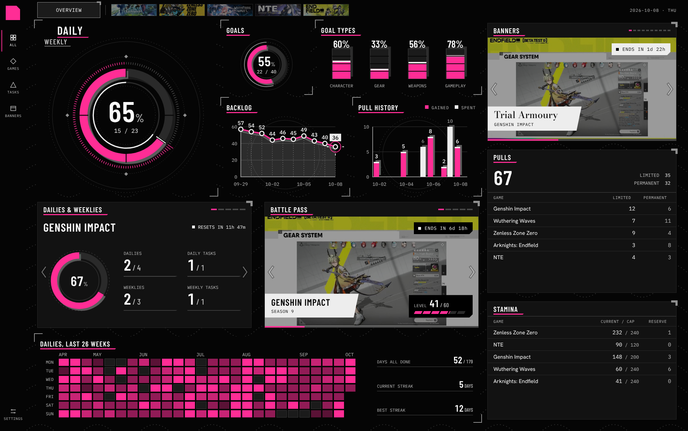

# Visual design

> How the app looks, taken from Georges's "All games dashboard" design (Claude Design canvas, 2026-10-08, desktop 1920×1204). `docs/WIREFRAMES.md` sets what each screen holds; this file sets how everything looks, and its values are the source for `apps/web` styles. Items marked **Proposed** are not in the design and wait for Georges. Decision record: ADR 0007. The design itself (picture, static page and source) is in `docs/design/dashboard/`.

## 1. Direction

- An industrial HUD in the spirit of Arknights: Endfield's "instruction manual" interface: a near-black page, flat opaque panels, square corners, hairlines and cut corners, condensed figures and mono labels.
- One accent colour carries the data and the current state. Everything else is greys and an off-white "paper".
- Urgency is a paper-white chip, never a colour: nothing turns red, amber or green.
- Graphs float on the page; content sits on cards. Graphs gain depth on hover; cards stay still.
- No rounded corners, panel shadows, gradients, blur or emoji.

## 2. Colour tokens

```css
:root {
  --bg: #050505;              /* page and graph panels */
  --card: #121212;            /* content cards */
  --edge: #262626;            /* card border */
  --surface-2: #1b1b1b;       /* hover, current item, tracks, empty heat cells */
  --surface-3: #2a2a2a;       /* row rules, gauge tracks, rings */
  --grid: #3a3a3a;            /* chart grid (a literal in the design) */
  --hairline: #474747;        /* buttons, dividers, idle pips */
  --ext: #5c5c5c;             /* extruded back faces of chart marks */
  --hairline-strong: #8f8f8f; /* corner marks, braces, axes */
  --text: #fafafa;
  --text-muted: #bebebe;
  --paper: #ededed;           /* chips, tooltips, title bands, second data series */
  --on-paper: #080808;
  --wave: #303030;            /* page pattern */
  --accent: #ff2d95;          /* set per scope (section 3) */
}
```

- Running text is `--text` or `--text-muted` on `--bg`, `--card` or `--surface-2` (contrast above 10:1). The accent marks data and state; it is not used for running text.
- Selected text is paper with `--on-paper` text.

## 3. Accent by scope

Only `--accent` changes with scope; greys, paper and type never do. It is set once on the scope's container from the game module's `accent` field, with no per-game stylesheets.

| Scope | Accent |
| --- | --- |
| Overview (all games) | `#FF2D95` magenta, with no colour setting. The design also tried `#FF4A3D`, `#FF8A2B` and `#3FD6E8`. |
| Genshin Impact | `#FFAA33` |
| Honkai: Star Rail | `#FF8FD1` light pink (not in the design; Georges's choice), lighter than the Overview's magenta so the two stay distinct. |
| Zenless Zone Zero | `#8CFF3A` |
| Wuthering Waves | `#2EE6C8` |
| Neverness to Everness | `#1F9BFF` |
| Arknights: Endfield | `#FFE600` |
| A character's pages | The character's element or attribute colour from the game module ("green on a green character's page"), else the game's accent. |

These replace today's module accents (`#d9a441` Genshin, `#8a7dff` HSR, `#f5e02c` ZZZ, `#9ad0ff` WuWa, `#2dd4bf` Endfield).

## 4. Type

All four families are under the SIL Open Font License and self-hosted (section 12).

| Family | Weights | Use |
| --- | --- | --- |
| Barlow Condensed | 400, 500, 600 | panel titles, figures, game names; tabular numerals |
| IBM Plex Mono | 400, 500 | labels, dates, counters, table numbers, buttons, chips; tabular numerals |
| Hanken Grotesk | 400, 500 | body text and names in lists |
| Bodoni Moda | 500 | banner titles over art, nowhere else |

| Role | Setting |
| --- | --- |
| Hero figure | Barlow 600 at 80 px (dailies) or 56 px (pulls total); unit or "%" at 40 % size, 500, muted |
| KPI figure | Barlow 600 at 44 px with "/ total" at 22 px muted; small gauges 38 px with a 16 px unit |
| Readouts | Barlow 600 at 24 to 36 px |
| Panel title | Barlow 600, 20/20 px, uppercase, tracking .06em |
| Period switch | Barlow 600, 32 px, uppercase, tracking .06em |
| Game name on a card | Barlow 600 at 32 px (carousels) or 26 px (bands), tracking .04em |
| Banner title | Bodoni Moda 500, 26 px |
| Body and list names | Hanken 400, 15 px |
| Chart labels | Plex Mono 13 px muted; highlighted values 15 px 500 white |
| Labels, buttons, chips | Plex Mono 12 px uppercase, tracking .06 to .08em |
| Table headers | Plex Mono 11 px uppercase, tracking .06em, muted |
| Rail labels | Plex Mono 10 px uppercase, tracking .06em |

Numbers are always tabular. Titles, labels and buttons are uppercase; names and sentences are not.

## 5. Layout

- Reference frame 1920×1204: left rail 72 px; top bar 56 px with 32 px side padding; content padding 8 px 32 px 32 px; 24 px gaps (36 px between the two carousel cards).
- Panel header 40 px; list row 34 px; table header 28 px; button 28 px. Spacing sits on a 2 px grid, mostly 8, 12, 16, 24 and 32 px.
- Corners are square everywhere. A cut corner marks something laid on top: chips, tooltips, title bands and the logo tile.
- **Page pattern:** dotted sine waves in `--wave` (a 160×56 tile, a dot every 8 units along the wave) cover the page. Panels are opaque, so the pattern shows only in the gaps.
- Desktop first. Narrower widths follow the WIREFRAMES.md conventions (columns stack; charts and tables scroll inside their panel); there is no separate mobile design yet.

## 6. Panels

Two kinds, never mixed:

| | Graph panel | Card |
| --- | --- | --- |
| Holds | charts, gauges, figures | lists, tables, forms, carousels, art |
| Fill and edge | the page colour, no border | `--card` with a 1 px `--edge` border |
| Frame | two corner marks, top left and bottom right: 22 px, 2 px `--hairline-strong`, set 9 px outside the box | one corner brace at the top right: an 18×15 px L, 6 px thick, `--hairline-strong`, set 4 px outside |
| Header padding | 8 px | 16 px |
| On hover | layered tilt (section 9) | nothing |

**Panel header (40 px):** the title on the left, underlined by a 3 px accent bar set 6 px below it, running 16 px past the text and ending in a 45° cut. Pips, legends or a counter sit on the right.

## 7. Components

- **Rail.** The logo is a 40 px accent square with its top-right corner cut by 10 px. Items are 64×60: an 18 px line icon (inline SVG, 1.5 px stroke) over a 10 px mono label; muted, white on hover; the current item is white with a 2 px accent bar on its left. Settings sits at the bottom.
- **Scope strip** (top bar). "Overview" is pinned on the left (a 176×44 card, mono 14 uppercase), then a divider, then the games as picture cards (128×34) showing each game's art under a 50 % `--bg` layer that clears when the card is current or hovered. The current game grows to 176×44 and takes a small corner brace. Any card lifts under the pointer (scale 1.14 with the system's only shadow, `0 10px 22px` at 70 % black). The strip drags sideways with a little inertia and follows the user's game order. The date sits on the right (mono 12 muted, "2026-10-08 · THU").
- **Buttons.** Mono 12 uppercase, 28 px tall, 12 px side padding, a 1 px `--hairline` border and muted text; on hover `--surface-2` with white text and border. Icon buttons are 24×24 in the same style. **Proposed:** a primary action is the same button filled with `--paper` (the design has none).
- **Focus.** A 2 px accent outline, 2 px out, on every interactive element.
- **Tags and chips**, each with its bottom-right corner cut by 8 to 9 px:
  - *dark tag* over art: black, white text, 8 px square paper dot;
  - *paper chip*: `--paper` with `--on-paper` text and dot, for what needs attention (an urgent deadline, "VIEWING · date");
  - *title band* over art: paper from the left edge, its right edge slanted by 14 px; a Barlow game name or Bodoni banner title over a mono 12 caption;
  - *tooltip*: paper, a mono 11 date over a Barlow 24 figure.
- **Urgency.** A banner, event or pass ending within 48 hours, or a daily reset within 3 hours, turns its chip paper.
- **Pips.** Carousel position: 16×4 px bars, 4 px apart, in `--hairline`, the current one in the accent; 8 px wide past eight items.
- **Legend keys.** 10 px squares before mono labels (accent for gained, paper for spent).
- **KPI tile.** A mono 12 muted label over a Barlow 44 figure, on a 2 px `--hairline` rule with a cut end.
- **Lists and tables.** Rows 34 px with a 1 px `--surface-3` rule and `--surface-2` on hover; names in Hanken 15, numbers in mono 15 aligned right, secondary columns muted. The header row is 28 px, mono 11 muted, under a `--hairline` rule. The scrollbar is 12 px: a square `--hairline-strong` thumb on a finely ruled rail, the accent on hover and while held (thin on Firefox).
- **Carousels** (cards). Art fills the card (`object-fit: cover`) under a 40 % `--bg` layer so chips stay legible. Chevron arrows (44×88) sit inside the card edges: 40 % opacity at rest, 80 % while the card is hovered, full with a dark zone and an accent stroke when pointed at. Auto-rotation runs a 4 px accent progress bar along the bottom. A game with more banners stays longer (6 s plus 3 s per extra banner) but shows each banner for less; the nearest deadline comes first. **Proposed:** rotation pauses on hover and focus and stops under reduced motion (WCAG 2.2.2).
- **Period switch.** Two labels on a loop, DAILY and WEEKLY: the current one big and white with the accent underline, the other small and muted below it to the left. A click swaps them counter-clockwise in 0.7 s. It switches the dailies gauge and both charts between days and weeks.

## 8. Charts

Hand-written inline SVG: neutral structure, accent data.

- **Structure:** grid 1 px `--grid` (dashed 3/4 for guides); axes 2 px `--hairline-strong`; labels mono 13 muted; the current value on a paper label.
- **Series:** the main series in the accent; a comparison series in paper (spent against gained); a 4 px paper cap on bar tops; areas under lines in white at 16 %.
- **Gauges:** a `--surface-3` track; the accent arc with square ends; the same arc offset 7 px down and right in `--ext` behind it (the extruded face); a dashed outer ring; tick bars around the arc, accent where done; diamond ticks at the four compass points; the figure in the centre.
- **Bars:** a `--surface-2` track with a `--hairline` edge and a `--surface-3` block offset up and right behind it; accent fill, paper cap, `--bg` lines at each quarter; the percentage above in Barlow 28.
- **Lines:** a 4 px accent line over a 4 px `--ext` ghost, dotted stems to the axis, point rings (`--bg` fill, 3 px paper ring), and an accent reticle with a cross on the current point.
- **Segmented bar** (battle pass): slanted segments, one per ten levels, 4 px apart; `--surface-3` track, accent fill.
- **Heatmap** (26 weeks × 7 days): cells 28×20 px, 4 px apart. An empty day is `--surface-2` with a `--grid` edge; levels 1 to 4 are the accent at 34, 56, 78 and 100 %, by the share of games with every daily done (up to a third, up to two thirds, more but not all, all). Hover outlines a cell in white and shows a tooltip; a click pins the day and outlines it in paper; arrow keys move and Enter pins.
- **Assistive text:** every chart has `role="img"` and an `aria-label` stating its numbers ("Genshin Impact: 11 of 17 recurring items done").

## 9. Depth and motion

- **Layered tilt** (graph panels only). On hover the stage turns with the pointer, up to 8° about the vertical axis and 7° about the horizontal (perspective 1200 px, 0.18 s ease-out), and its layers separate: rings 10 px, structure 48 px, data 80 px, figures 112 px, ticks 140 px, each scaled down to keep its apparent size. Cards, lists and the heatmap never tilt.
- **Transitions:** 0.2 s for hover colours; 0.3 to 0.45 s for the strip, `cubic-bezier(.2,.8,.2,1)`; a springy `cubic-bezier(.34,1.5,.64,1)` for lifts and braces; 0.7 s `cubic-bezier(.65,0,.25,1)` for the period switch.
- **Reduced motion:** no transitions and no auto-rotation; **Proposed:** no tilt either (the design only drops transitions).

## 10. The Overview dashboard (A1)

The reference screen; its content follows WIREFRAMES.md A1.



- **Main column, 1232 px:**
  - Graphs, 476 px tall: the dailies gauge with the period switch (496 px wide); beside it the goals gauge (240×192) and goal-type bars, above backlog (line) and pull history (bars, gained against spent), each 260 px tall.
  - Carousels, 352 px: dailies and weeklies per game (name, reset chip, gauge, four KPI tiles); battle pass per game (art, "ends in" tag, level tag with the segmented bar).
  - Heatmap, 232 px: dailies over the last 26 weeks, with days all done, current streak and best streak beside it. A pinned day shows its date, the games done and a checklist of games.
- **Side column, 528 px, all cards:** banners carousel (330 px); pulls (400 px: the total, limited and permanent, then a table per game); stamina (330 px: now / cap and reserve per game).
- A game scope shows the same dashboard for that game in its accent.
- Pinning a heatmap day switches the whole dashboard to that day: a "VIEWING · date" paper chip and BACK TO TODAY appear in the top bar, and reset chips read DAY CLOSED.
- WIREFRAMES.md A1 adds "Endgame · next resets" and "Expiring soon"; both are cards in the list style.

## 11. Other screens

Guidance for F8 to F10, to adjust in review:

- Charts, gauges and KPI strips go on graph panels; lists, tables, forms and art go on cards.
- Character cards and the character sheet lead with splash art on a card, with tags and bands laid over it (constellation as a dark tag, the name in a band).
- **Proposed:** segmented switches (50/50 | GUARANTEED, Timeline | List) as mono 12 cells in one 1 px `--hairline` frame, the current cell paper; AUTO and MANUAL source labels as mono 11 dark tags.
- **Proposed:** form controls as square inputs and selects with a 1 px `--hairline` border on `--surface-2`, mono labels above, a white border on hover and the accent focus ring; checkboxes as 10 px squares like the heatmap checklist, accent-filled when on.

## 12. Implementation notes

- Fonts as woff2, Latin subset, in `apps/web/public/fonts/` with their OFL texts and `font-display: swap`; preload Barlow Condensed 600 and IBM Plex Mono 400. No Google Fonts requests, so the CSP keeps fonts and styles on `'self'`. About 150 KB in all, outside the 200 KB JavaScript budget.
- One tokens stylesheet, `apps/web/src/styles/tokens.css`, replaces the variables in `apps/web/src/styles.css` (the old set is listed in DESIGN-HANDOFF.md §2).
- Corner marks, braces, cuts and the pattern are CSS and inline SVG, not images.
- Art in the strip, banners and passes comes from the art store (ADR 0006); the design used placeholder art.
- Each screen PR is checked at 1920×1204 against this file and by the axe job, with a screenshot attached.

## 13. Decisions and defaults

Decided by Georges on 2026-10-09:

- HSR's accent is light pink `#FF8FD1`.
- The Overview accent stays magenta; there is no colour setting.

Defaults to build until Georges says otherwise (each shows in the PR screenshots, where he can change it):

- The page pattern is always on.
- The items marked **Proposed** in this file are built as written: primary button, form controls, segmented switches, rotation pause, no tilt under reduced motion.
- The heatmap needs a per-day record of completed dailies, which does not exist yet (`Task` keeps only `lastCompletedAt`). Milestone V builds the heatmap and its readout with today filled in; F8 adds the record (DESIGN.md §8) to fill past days. Pinning a past day waits for that record.
